_Грубо говоря, очевидно, что некоторые виды форматирования лучше других._
_— Стив Макконелл, Совершенный код._

Эта статья об особенностях человеческого зрения и о том, как знание этих особенностей может помочь нам улучшить объективную удобочитаемость наших программ.
<cut />

# Содержание

* [Вступление](#intro)
* [Особенности зрения человека ](#visionspecifics)
* [Как мы читаем обычные тексты](#textreading)
* [Понимание программ](#comprehension)
  * [Когнитивные модели понимания программ](#cognitivemodels)
    * [Концепции и терминология](#concepts)
    * [Модель понимания от общего к частному](#topdownmodel)
    * [Понимание от частного к общему](#downtopmodel)
    * [Оппортунистическая и систематические стратегии](#strategies)
  * [Специфика чтения текста программы](#codereading)
  * [Роль идентификаторов](#identifiers)
* [Обобщение результатов](#analysis)
  * [Визуальное представление](#visualrepresentation)
  * [Длина строки](#linelength)
  * [Имена](#names)
  * [Пробелы](#spaces)
  * [Расстановка фигурных скобок](#braces)
* [Заключение](#resume)

<h1 id="intro">Вступление</h1>
_Рискуя вызвать резкое неудовольствие со стороны моих коллег, я применяю принципы, в которые верю с какой-то безрассудной односторонностью. Частично я это делаю в силу того, что в отдельных случаях полезно изложить свою точку зрения с голой простотой и тем самым предоставить дальнейшую шлифовку своей концепции последующим ударам и контрударам критики._
_— Рудольф Арнхейм, Искусство и визуальное восприятие._

_Компьютерный язык — это не просто способ заставить компьютер производить вычисления, а новое формальное средство выражения методологических идей. Таким образом, программы должны писаться для того, чтобы их читали люди, и лишь во вторую очередь для выполнения машиной._
_— Харольд Абельсон, Джеральд Д. Сассман, Структура и интерпретация компьютерных программ._

_Соотношение времени чтения и написания кода превышает 10:1. … Из-за столь высокого соотношения наш код должен легко читаться, даже если это затрудняет его написание._
_— Роберт Мартин, Чистый код: создание, анализ и рефакторинг._

Наверно, никому не надо доказывать то, что _легкость восприятия_ (_удобочитаемость_) текста программы является одним из решающих факторов, определяющих успешность её сопровождения и развития.

Обычно, когда оценивают текст программы с точки зрения ее _легкости восприятия_, используют термин _удобочитаемость_. Строго говоря, это не совсем одно и то же, поскольку, как будет показано далее, процесс восприятия программы это больше, чем просто чтение.  Тем не менее, поскольку речь идет о тексте, и термин _удобочитаемость_ можно считать достаточно устоявшимся, я также буду использовать его в этом смысле.

Для поддержания удобочитаемости кода в процессе разработки программы обычно договариваются о некотором общем своде правил форматирования (стиле) исходного кода. Уже само по себе наличие свода таких правил, несомненно, оказывает положительное влияние на его качество и  удобочитаемость, так как формирует у программистов определенные привычки относительно тех языковых конструкций, которые они ожидают увидеть в тексте программы.

Тем не менее, отдельные правила часто вызывают вопросы, поскольку критерии их выбора неясны, и они нередко противоречат аналогичным правилам в других подобных стилях.

Правила задают конкретные детали оформления кода в целях поддержания удобочитаемости, но при этом нет объяснения того, как эти правила помогают ее достичь. Решение инженерной задачи формирования удобочитаемого, то есть оптимального с точки зрения легкости восприятия текста программы, подменяется следованием формальным и часто произвольно выбранным правилам, что не позволяет достичь требуемого результата. Необходимость выполнения свода формальных правил, без возможности объяснить целесообразность каждого из правил в отдельности, и которые к тому же меняются при переходе с проекта на проект, с языка на язык, формирует ложное представление о том, что сами по себе правила не так важны, и выбор того или иного стиля это всего лишь дело вкуса и привычки.

Действительно, наши привычки во многом определяют насколько комфортно мы чувствуем себя в той или иной ситуации и, в частности, воспринимаем тот ли иной стиль форматирования. Но ощущение комфорта вследствие привычки не позволяет нам судить, насколько объективно хорош этот стиль: очевидно, что привычка к какому-то стилю может означать, что мы просто перестали замечать специфические особенности этого стиля, которые на деле могут быть контрпродуктивными в смысле формирования объективно удобочитаемого кода.

Говоря об объективной удобочитаемости, я подразумеваю, что полная удобочитаемость текста состоит из субъективной составляющей, вызванной выработанными привычками и навыками, и о которой мы говорили выше, и объективной, определяемой общими для всех нормальных в психическом и физическом состоянии людей механизмами восприятия и обработки визуальной информации, их возможностями и ограничениями.

Таким образом, субъективная составляющая связана с некоторыми частными привычками, которые могут быть изменены, а объективная — с общими психофизическими особенностями зрения человека, которые мы не предполагаем возможным изменять. Поэтому, говоря об оптимизации текста программы, имеет смысл говорить лишь об объективной составляющей удобочитаемости, и поэтому далее в этой статье термин удобочитаемость всегда будет относиться к этой её составляющей.

Давайте посмотрим подробнее, на то, что нам известно о механизмах восприятия человеком зрительной информации, чтении текстов вообще и чтении и восприятии текстов программ.

<anchor>visionspecifics</anchor>
# Особенности зрения человека[⁹](#9)
[Поле зрения](https://ru.wikipedia.org/wiki/Поле_зрения) человека достаточно велико: 55° вверх, 60° вниз, 90° наружу (то есть суммарное поле зрения двумя глазами — 180°) и 60° внутрь. Однако внутри этого поля острота зрения и цветовосприятие распределены неравномерно: острота зрения порядка 1' достигается в области _фовеа_, формирующей ~2° центрального (_фовеального_) зрения, но она не так хороша в _парафовеальной_ области (которая покрывает 5° в обе стороны от точки фиксации) и еще хуже на периферии.[¹](#1)

Подобным же образом от центра к краю падает и способность различать цвета, причем это изменение различно для разных цветовых компонент. Можно сказать, что, двигаясь от центра человеческой сетчатки к периферии, мы как бы оказываемся на более ранних этапах эволюции, переходя от наиболее высоко организованных структур к примитивному глазу, который различает лишь простое движение теней.

**Поле зрения правого глаза человека. Оранжевое пятно — место проекции слепого пятна глазного дна. ([оригинал](https://ru.wikipedia.org/wiki/%D0%9F%D0%BE%D0%BB%D0%B5_%D0%B7%D1%80%D0%B5%D0%BD%D0%B8%D1%8F#/media/%D0%A4%D0%B0%D0%B9%D0%BB:Goldmann_visual_field_record_sheet.svg))**

В современной нейропсихологии существует представлении об  _амбьентной_  (от фр. ambiance = окружение) и _фокальной_ зрительных системах. В то время как первая, эволюционно более древняя, ответственна за динамическую пространственную локализацию, вторая занимается идентификацией объектов.

**Сравнительные признаки фокальной и амбьентной систем**

| Зрительная система           | Фокальная | Амбьентная             |
| ---------------------------- | --------- | ---------------------- |
| Функция                      | Что       | Где/Как                |
| Включенность в движение      | Меньше    | Больше                 |
| Осознание/Память             | Больше    | Меньше или отсутствует |
| Временные свойства           | Медленная | Быстрая                |
| Чувствительность к освещению | Высокая   | Низкая                 |
| Пространственное разрешение  | Высокое   | Низкое                 |

Объекты, представляющие собой источник нужных сведений, распределены далеко неравномерно. Обычно они локализованы в небольших участках поля зрения. При этом с помощью амбьентного зрения обнаруживается потенциально интересный объект или элемент объекта, а при помощи фокального зрения направленного на объект, эти сведения воспринимаются и анализируются более детально. Сталкиваясь с новой ситуацией или с новым объектом, мы, как правило, сначала смотрим «широким полем» и лишь затем концентрируем наше внимание на деталях.

Обследование окружения и выбор объектов для детальной обработки осуществляется с помощью движений головы и тела, на которые накладывается тонкий узор движений глаз.  Наиболее известной их разновидностью являются _саккады_ — чрезвычайно быстрые (~500°/сек) скачки баллистического типа, меняющие положение глаз в орбите и позволяющие выделять фрагменты сцены для последующей _фиксации_.

###### Репродукция картины И. Е. Репина и запись движений глаз испытуемого.[¹¹](#11)

<!--  -->
Начало исследованиям соотношения амбьентной (глобальной) и фокальной (локальной) зрительной обработки было положено в экспериментах Дэвида Навона в 1977. Он предъявлял испытуемым большие буквы, состоявшие из маленьких букв. Некоторые из этих составных стимулов были «однородными» — глобальная форма и локальные элементы представляли собой одну и ту же букву. Другие были «неоднородными» — глобальная и локальные буквы были разными (скажем, «Е» и «S»). Испытуемые должны были как можно быстрее идентифицировать глобальную или локальную букву.

<!--  -->

Оказалось, что при настройке на глобальную форму она идентифицируется быстро и без всякой интерференции со стороны совпадающих или несовпадающих букв локального уровня. При настройке на идентификацию деталей картина была иной. Во-первых, ответы были более медленными. Во-вторых, в случае неоднородных стимулов ответы дополнительно замедлялись и становились менее точными. Очевидно, _настраиваясь на детальную обработку, мы не всегда можем игнорировать глобальную информацию_.

В результате исследований отношения глобальной и локальной обработки, тестируемые с помощью супербукв Навона, была обнаружена возможно дифференциальная роль задних отделов левого и правого полушарий. При этом левое полушарие оказалось скорее регулятором настройки на детали, а правое — на глобальные очертания. Чрезвычайно интересным оказалось влияние эмоций: отрицательные эмоции, в отличие от положительных, усиливали установку на восприятие деталей.

Интересной особенностью нашего зрения является способность воспринимать группу объектов как единое целое. Так на изображении ниже мы видим собаку, а не просто хаотический набор пятен:

<!--  -->
А здесь мы ясно различаем квадрат и круг[¹⁰](#10):

<!--  -->
Есть множество объяснений возникновения подобных иллюзий. С точки зрения когнитивной биономии потребность видеть формы, грани и движения (а также лица) была продиктована необходимостью в выживании. Таким образом, даже при отсутствии реальных линий или форм наша сенсорно-когнитивная система использовала частичную информацию, чтобы создать эти формы в попытке сделать понятным внешне хаотический мир.

Посмотрите на рисунок ниже, и вы увидите как с течением времени ориентация треугольников меняется с одного направления на другое, третье[¹⁶](#16).

<!--  -->
Наш мысленный взгляд постоянно ищет альтернативную перцептивную организацию. При этом попытки увидеть эти треугольники как направленные в разные стороны требуют больших ментальных усилий, возможны только для небольшого их числа и оказываются менее устойчивыми.

Первыми это явление стали изучать гештальтпсихологи. Так, они сформулировали основной закон зрительного восприятия, согласно которому _любая стимулирующая модель воспринимается таким образом, что результирующая структура будет, насколько это позволяют данные условия, наиболее простой_. Поэтому мы воспринимаем квадрат именно так, как он изображен слева, а не каким-то другим образом:[¹⁰](#10)

<!--  -->
Гештальтпсихологи также сформулировали 6 принципов перцептивной организации. В соответствии с этими принципами _объекты, которые_

- _расположены близко друг к другу («закон близости»),_
- _имеют похожие яркостные и цветовые характеристики («сходства»),_
- _ограничивают небольшую, замкнутую («замкнутости»)_
- _и симметричную область («симметрии»),_
- _естественно продолжают друг друга («хорошего продолжения»),_
- _движутся примерно с равной скоростью в одном направлении («общей судьбы»),_

_скорее будут восприняты как единое целое, или фигура, а не как разрозненные элементы среды, или фон_.

На иллюстрациях ниже[¹⁰](#10) показаны примеры сходства по близости, цвету и размеру.

<!--  -->

В случае конкуренции нескольких факторов перцептивной организации преимущество, как правило, отдается фактору _близости_, а затем фактору _сходства по окраске_, _ориентации_ или _размеру_.

Учет этих принципов оказывается важным в случае перцептивного поиска или восприятия, поскольку, _если информация организована в соответствии с этими принципами, решение поставленной задачи требует меньших усилий за счет того, что перцептивное поле подвергается группировке, и на образовавшиеся группы элементов последовательно выделяется всё меньшая доля общих ресурсов_. Распределение ресурсов внутри каждой группы оказывается примерно равномерным.

Задачи зрительного поиска обычно затрудняются при добавлении иррелевантных объектов (_дистракторов_). Однако _в случае, когда дистракторы образуют визуально компактные группы, позволяющие игнорировать их как целое, их добавление наоборот может значительно облегчить поиск_.

Подобно асимметрии между левой и правой рукой существует некоторая асимметрия в том, как мы воспринимаем левое и правое визуальные поля. Трудно утверждать, связано ли это с ассиметрией в левом и правом полушариях мозга, ответственных за обработку сенсорной информации от правого и левого поля зрения соответственно, либо от выработанной привычки.

Так, в сценическом искусстве известно, что существует разница между левой и правой половиной сцены: как только подымается занавес в начале акта, зрители начинают смотреть в левую сторону сцены. Левая сторона сцены считается более сильной. В группе из двух или трех актеров тот, кто стоит с левой стороны, будет в данной сцене доминировать. Аналогично, зритель воспринимает рисунок, как если бы он свое внимание сосредоточил на левой стороне. Субъективно он отождествляет себя с левой стороной, и все, что появляется в этой части картины, имеет большое значение. Таким образом, кроме естественной точки равновесия в центре визуальной сцены, формируется дополнительный центр в ее левой части[¹⁰](#10).

<anchor>textreading</anchor>
# Как мы читаем обычные тексты[¹](#1)

Когда мы читаем, наши глаза непрестанно совершают быстрые механические (т.е. не контролируемые сознанием) движения, _саккады_ (_saccades_). В среднем их длина составляет 7-9 символов. В это время мы не получаем новой информации. Основная функция саккад заключается в перемещении новой области текста в область фовеального зрения (2° центральной области видимости) для детального анализа, потому что чтение в области парафовеального или периферического зрения сильно затруднено или невозможно.

**Типичная картина движений глаз при чтении[⁹](#9)**

<!--  -->
Между саккадами наши глаза остаются относительно неподвижными на время _фиксаций_ (_fixations_) (около 200 – 300 мс). В течение этого периода мы распознаем видимую часть текста и планируем, куда совершить следующий cкачок.

Порядка 10–15% времени читающие переводят свой взгляд назад в тексте (_regressions_), чтобы повторно прочитать то, что уже было прочитано. С возрастанием трудности текста увеличивается продолжительность фиксаций и частота регрессий, а длина саккад уменьшается.

Длина саккады определяется в размерах букв, а не угловых величинах, и не изменяется с изменением расстояния от глаза до монитора с текстом.[¹⁵](#15)

Во время фиксации мы получаем информацию из области видимости, называемой _областью восприятия_ (_perceptual span_). Размер этой области относительно невелик: в случае алфавитных орфографий (напр. для европейских языков) она начинается от начала фиксированного слова, но не более, чем на 3-4 буквы слева от точки фиксации, и распространяется приблизительно на 14-15 размеров букв вправо от этой точки (суммарно 17-19 букв).

_Область идентификации_ (_identification span_), то есть область видимости, необходимая для идентификации фиксированного слова, меньше, чем область восприятия и, как правило, не превышает 7-8 размеров букв справа от фиксации (суммарно порядка 10-12 букв).

Доступность первых 3 буквы слова во время предыдущей фиксации приводит к снижению времени фиксации на этом слове. Некоторые исследователи также показали, что информация о буквах справа от фиксации может быть использована для определения должно ли следующее слово быть пропущено.

Большинство исследователей полагают, что информация о границах слова (обеспечиваемая промежутками между словами) является основным фактором в определении места следующей фиксации. Длина саккады зависит как от длины фиксированного слова, так и от длины слова, следующего за ним.

В большинстве случаев чтение замедляется (в среднем на 30%) при отсутствии информации о промежутках (между словами). Это вызвано нарушением процессов идентификации слова  и перемещения взгляда. Наоборот, добавление информации о промежутках облегчает чтение. Так, существуют данные, показывающие, что при разделении слов в тексте на тайском языке (для людей, которые никогда прежде не читали такие тексты с разделением слов пробелами), чтение осуществляется более эффективно. Аналогично облегчается и чтение длинных составных слов на немецком языке при разбивке их на простые слова с помощью пробелов, несмотря на то, что такое разбиение грамматически некорректно и не встречается в обычном чтении.

Информация о длине слова также играет явную роль в определении того, где должна располагаться точка фиксации. Хотя присутствует некоторая вариативность в том, где внутри слова останавливается взгляд, как правило первая фиксация на слове осуществляется в _предпочитаемой точке взгляда_ (_preferred viewing location_), где-то на расстоянии 1/4 длины слова от его начала. Когда промежуток между текущим и следующим словами попадает в парафовеальную область, первая фиксация на следующем слове происходит ближе к предпочитаемой точке, чем когда этот промежуток оказывается за ее пределами.

Несмотря на то, что в среднем позиция первой фиксации на слове лежит между началом слова и его серединой, эта позиция может меняться в зависимости от расстояния до предыдущей точки фиксации. Например, если расстояние до целевого слова большое (8-10 размеров букв), положение следующей фиксации сдвигается влево. Соответственно, если расстояние мало (2-3 размера букв), положение фиксации сдвигается вправо.

Позиция первой (и возможно единственной) фиксации на слове лежит между началом и серединой слова для слов длиной 4-10 буквы. Однако для более длинных слов наблюдается тенденция делать первую фиксацию ближе к началу слова и затем делать вторую ближе к концу слова.

Информационная плотность (или морфологическая структура) слова влияет на продолжительность фиксаций на каждой части слова. Например, было замечено, что если слово было возможно распознать по первым 6 буквам (слова были в среднем длиной около 12 букв), то в общем случае, после первой фиксации в первой половине слова, взгляд переходил к следующему слову; в случаях, когда фиксация во второй части все же осуществлялась, то она была очень короткой. Однако в случае, когда слово могло быть распознано только по его окончанию, первая фиксация была короткой, а вторая, на конце слова, более длинной.

**Таблица 1. Приблизительные средние значения продолжительности фиксаций и длин саккад при чтении и поиске**

| Задача           | Средняя продолжительность фиксации (мс) | Средний размер саккады (градусы) |
|------------------|-----------------------------------------|----------------------------------|
| Чтение           | 225                                     | 2 (~ 8 букв)                     |
| Чтение вслух     | 275                                     | 1.5 (~ 6 букв)                   |
| Визуальный поиск | 275                                     | 3                                |
| Восприятие сцен  | 330                                     | 4                                |
| Чтение нот       | 375                                     | 1                                |
| Печать           | 400                                     | 1 (~ 4 буквы)                    |

При исследовании визуального поиска установлено, что когда цель находилась в области с небольшим _эксцентриситетом_ (отклонением от центра сцены), она обнаруживалась точно, с использованием одной саккады; когда цель располагалась ближе к периферии, наблюдались саккады в ложных направлениях (до 40% по времени). _При сложных задачах поиска глаза изначально направлялись к центру сцены и затем к центрам рекурсивно меньших групп объектов до тех пор, пока цель не была найдена_.

<anchor>comprehension</anchor>
# Понимание программ
Программы отличаются от обычных текстов. Программы составлены из ограниченного набора слов и организованны иначе, чем обычные тексты: в них широко используются формально определенные структуры, обозначаемые в тексте с помощью специальных синтаксических конструкций. Кроме того, существует и семантическое отличие. Восприятие обычного текста, в общем случае, состоит из двух параллельных фаз: восприятие самого текста и осмысление того, о чем он повествует. Когда речь идет о тексте программе, осмысление означает осознание синтаксической и семантической структур программы, но также включает и осознание операционной семантики программы, то есть того, как изменяется состояние программы в процессе её выполнения.[²](#2) Процесс чтения программы также отличается от чтения прозы. Кроме непосредственно чтения текста,  программисту приходится также сканировать текст с целью восприятия основных элементов верхнего уровня её иерархической структуры, осуществлять поиск отдельных идентификаторов, переходить от одного места в программе к другому, возможно расположенному в другом файле.

<anchor>cognitivemodels</anchor>
## Когнитивные модели понимания программ[³](#3)
<anchor>concepts</anchor>
### Концепции и терминология
_Ментальная модель_ описывает мысленное представление разработчика о программе, которую необходимо понять, в то время как _когнитивная модель_ описывает познавательные процессы и временные информационные структуры, которые используются для формирования ментальной модели в сознании программиста.

_План программирования_ (_programming plan_) – это фрагмент кода, представляющий типичный сценарий в программировании. Например, программа сортировки будет содержать цикл для сравнения двух чисел в каждой итерации. Планы программирования также часто называют _клише_ и _схемы_. _Делокализованный план_ (_delocalized plan_) возникает, когда план программирования реализуется в различных частях программы. Наличие делокализованных планов усложняет понимание программ.

_Маяк_ (_beacon_) это характерный элемент кода, который служит признаком присутствия в нем некоторой структуры. Например, имя процедуры может указывать на реализацию определенной функции.

_Правила написания программ_ (_rules of programming discourse_) охватывают принятые соглашения, такие как стандарты кодирования и реализации алгоритмов. Эти правила формируют определенные ожидания в сознании программиста.

<anchor>topdownmodel</anchor>
### Модель понимания от общего к частному
В этой модели предполагается, что процесс понимания программы происходит от общего к частному, когда воссоздание знания о прикладной области программы отображается затем на код программы. Процесс начинается с формулировки гипотезы об общем характере программы. Первичная гипотеза затем уточняется иерархическим способом путем формирования вспомогательных гипотез. Вспомогательные гипотезы уточняются и оцениваются в первую очередь по глубине. Верификация (или отклонение) гипотез сильно зависит от отсутствия или наличия маяков.
Процесс понимания программы от общего к частному используется, когда код программы или его вид знаком. При этом опытные программисты используют маяки, планы программирования и правила написания программ для декомпозиции целей и планов в планы более низкого уровня.

<anchor>downtopmodel</anchor>
### Понимание от частного к общему
Теория понимания программ от частного к общему предполагает, что программисты сначала читают код и затем мысленно группируют утверждения в коде в абстракции более высокого уровня. Эти абстракции в дальнейшем также группируются, и этот процесс повторяется пока не достигается высокоуровневое понимание программы.

<anchor>strategies</anchor>
### Оппортунистическая и систематические стратегии
При использовании этих стратегий программисты либо систематически читают код в деталях, отслеживая потоки управления и данных в программе, для получения целостного понимания программы, либо читают его по необходимости, фокусируясь только на коде, относящемся к текущей задаче. В первом случае, программисты получают как статическое знание о программе (информацию о ее структуре), так и знание о причинно-следственных связях в ней (знание о взаимодействии между компонентами при их выполнении). Это позволяет им сформировать ментальную модель программы. При оппортунистическом подходе программисты в основном получают статическое знание, приводящее в результате к формированию более слабой ментальной модели работа программы. Это приводит к большему числу ошибок, так как программисты не могут распознать причинно-следственные связи между компонентами внутри программы.

<anchor>codereading</anchor>
## Специфика чтения текста программы
Ниже представлены результаты одного эксперимента[¹²](#12)  в качестве примера, дающего представление о различии в чтении обычных текстов и текстов программ,

На рисунке ниже представлены траектории движения глаз двух программистов-экспертов при чтении одного и того же кода:

<!--  -->
Перед этими программистами были поставлены разные задачи: так, от первого (рис. слева) ожидали получить ответ, чему равно `rect2.area()`, второго предупредили, что ему будет задан вопрос относительно алгоритма с возможностью выбрать ответ из списка возможных.

Как мы можем видеть эти траектории достаточно сильно различаются, что связано, по-видимому, как  с разными задачами, поставленными перед ними, так и их индивидуальными особенностями.

Авторы эксперимента описывают манеру чтения кода первым испытуемым как совершенно непредсказуемую, когда он перескакивал с одного места на другое, практически нигде не задерживаясь на сколько либо продолжительное время.

Второй же испытуемый, по словам экспериментаторов, читал код медленно и методически.

Действительно на иллюстрации слева мы наблюдаем достаточно хаотическую траекторию с большим количеством длинных вертикальных саккад, а на правой – преимущественно горизонтальные саккады, большинство из которых можно связать с чтением текста в общем смысле.

Можно говорить о том, что в первом случае мы видим доминирование быстрого амбьентного зрения, характеризующегося длинными саккадами и короткими фиксациями, а во втором — медленного фокального.

Авторы описывают следующие базовые типы движений глаз, составляющие более сложные стратегии чтения кода:

| Тип                   | Описание                                                     |
| --------------------- | ------------------------------------------------------------ |
| Flicking              | Взгляд перемещается вперед и назад между двумя соотносящимися элементами, такими как списки формальных и актуальных параметров метода. |
| JumpControl           | Взгляд переходит на следующую строку, следуя за потоком выполнения. |
| JustPassingThrough    | Фиксации на свободном месте в процессе перехода куда-то еще. |
| LinearHorizontal      | Целая линия последовательно и равномерно читается целиком слева направо или справо налево. |
| LinearVertical        | Техт читается строка за строкой, как минимум, для трех строк, независимо от потока выполнения программы, не различая сигнатуру и тело функции. |
| RetraceDeclaration    | Частые, повторяющиеся скачки между местами использования и определения переменных. Вид Flicking. |
| RetraceReference      | Частые, повторяющиеся скачки между местами использования переменных. Вид Flicking. |
| Scan                  | Первичное поверхностное чтение всех строк кода сверху-вниз. Подготовительное чтение всей программы, которое занимает 30% времени на ее обзор (review). |
| Signatures            | Все сигнатуры функций просматриваются, перед тем как начать изучение тела метода/конструктора. |
| Thrashing             | Взгляд перемещается быстро и неконтролируемо в последовательности, которая кажется не имеет какого-то определенного смысла. |
| Word(Pattern)Matching | Простое сопоставление визуальных шаблонов.                   |

<anchor>identifiers</anchor>
## Роль идентификаторов[⁴](#4)
Идентификаторы в коде программы часто выполняют роль маяков для планов программирования, поддерживающих ментальные модели более высокого уровня. Идентификаторы составляют примерно 70% исходного кода.

В общем случае, использование целых слов в идентификаторах приводит к лучшему восприятию программы, чем при использовании сокращений.

Идентификаторы, которые нарушают некоторые правила, приводят к более низкому качеству кода (больше ошибок).

Использование более длинных имен снижает правильность и требует больше времени для запоминания.

При сравнении эффективности использования идентификаторов, использующих camelCase нотацию и нотацию с подчеркиванием, в задаче поиска было показано, что хотя вид использованной нотации не влияет на аккуратность результата, использование идентификаторов с подчеркиванием требует меньше времени и усилий для достижения того же результата.

<!--При исследовании влияния разных видов заполнений промежутков между словами на время чтения было обнаружено, что скорость уменьшалась на 10-75% в зависимости от вида заполнителя.-->

<anchor>analysis</anchor>
# Обобщение результатов
<anchor>visualrepresentaion</anchor>
## Визуальное представление
Априори мы знаем, что программа имеет определенную логическую и синтаксическую структуры, и ожидаем, что структура ее визуального представление будет соответствующим образом отражать их.

Как говорилось выше, наш мозг находится в постоянном поиске некоторого оптимального варианта интерпретации визуальной сцены, позволяющего объяснить ее наиболее простым образом. Поэтому можно утверждать, что, чем более явно сформирована визуальная структура, и чем более точно она отражает структуру программы, тем меньше ментальных усилий мы затратим на восприятие этой программы.

При визуальном восприятии программы, мы получаем первое впечатление и оцениваем визуальную структуру текста главным образом за счет амбьентного зрения, обладающим малой остротой и цветовосприятием, ухудшающимися от центра к краю. Быстрое амбьентное зрение помогает нам выделить точки интереса в коде для его дальнейшего анализа и чтения с помощью медленного фокального зрения. Это значит, что,  говоря об общей визуальной структуре текста программы, мы должны перейти из области фокального зрения, то есть из мира букв и символов, в область амбьентного зрения, то есть в область пятен и соотношений между ними.

Последовательность основных структурных элементов в программе располагается в вертикальном направлении, поэтому и при оценке общей визуальной структуры программы при охвате её «широким взглядом» преобладает вертикальное движение глаз, сопровождающееся небольшими отклонениями по горизонтали. Горизонтальное движение взгляда, связанное с переходом к фокальному зрению и непосредственно чтению, позволяет нам получить детали этих элементов.

Соответственно, для корректной оценки общей структуры программы важно сформировать корректную визуальную структуру в вертикальном направлении.

Например, в определении функции нам необходимо визуально разделить объявление функции, включающее её имя, возвращаемый тип, список параметров, и тело функции. Внутри тела функции необходимо разделить код инициализации начальных переменных, тело основного алгоритма, формирование и возвращение результата. В свою очередь, внутри кода инициализации нам надо разделить область типов, имен переменных и присваиваемых им значений.

Рассмотрим следующий пример:

<!-- 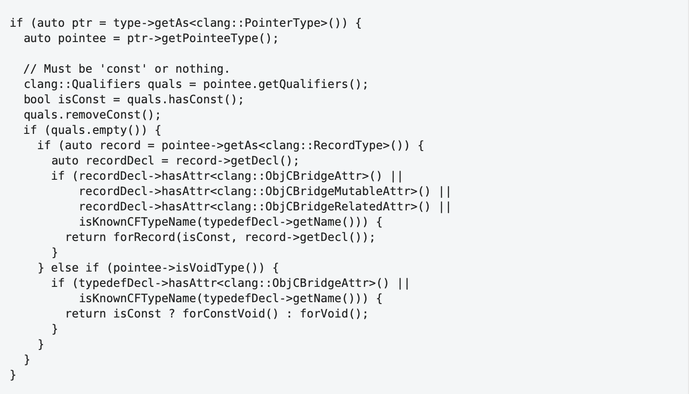 -->
Для оценки визуальной структуры проведем тест, аналогичный «тесту с прищуриванием» (_squint test_), популярному у разработчиков пользовательского интерфейса. Смысл этого теста заключается в том, чтобы попробовать сформировать расфокусированное изображение интерфейса, и оценить какое общее представление получает о нем пользователь в самый первый момент времени.

<!-- 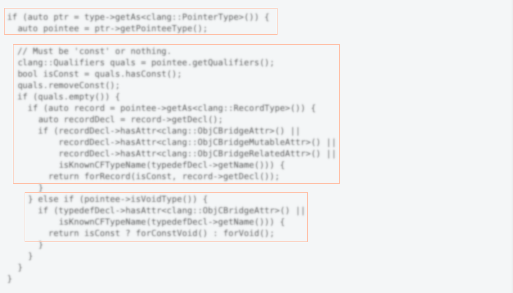 -->
Визуальная структура этого кода содержит лишь три большие области, что, очевидно, не отражает корректно структуру программы.

Разбивка по вертикали позволяет исправить этот недостаток:

<!-- 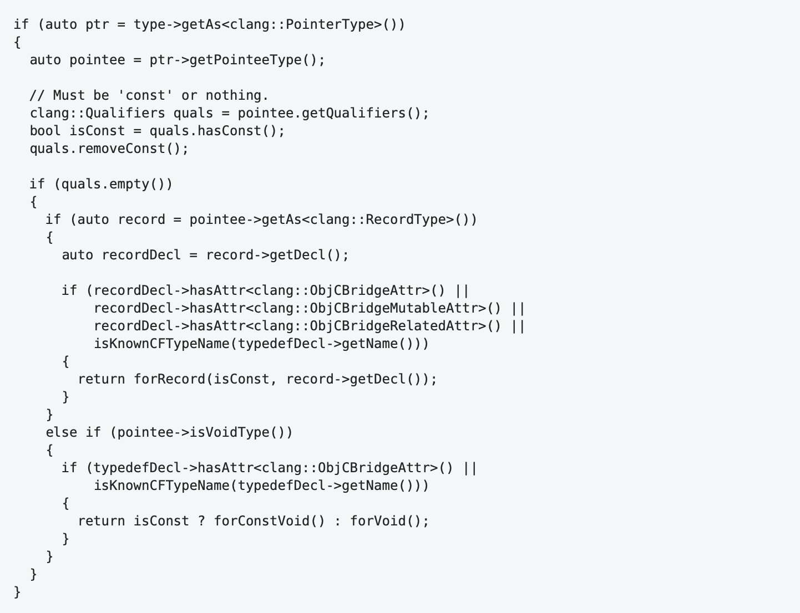 -->

Результат теста:

<!-- 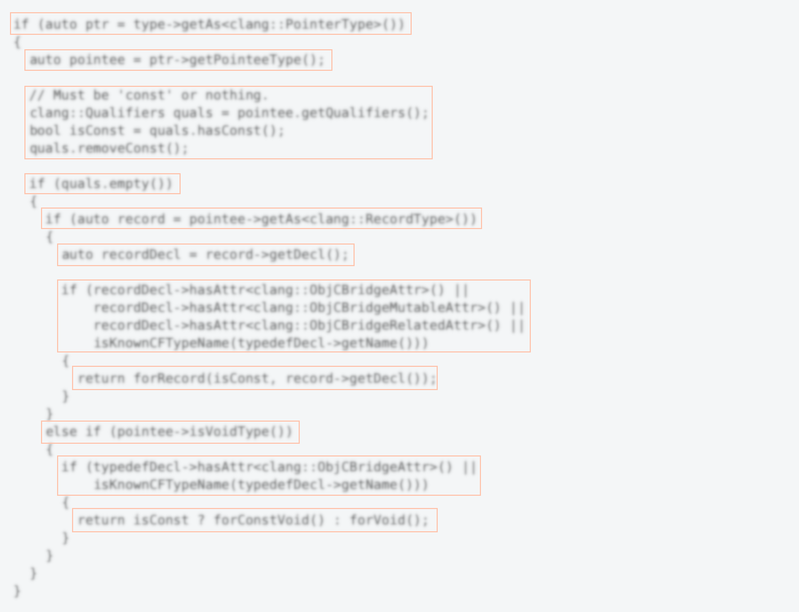 -->
Связанные области текста могут состоять из строк одинаковой структуры. В этом случае имеет смысл сгруппировать одинаковые элементы строк, подчеркнув тем самым их горизонтальную структуру. Такая группировка позволит выделить общее и сделает различия более заметным.

Таким образом, мы структурируем текст как по вертикали, так и по горизонтали. В первом мы случае выполняем эти разделения посредством добавления пустых строк. Во втором – мы используем отступы и выравнивание.

Отступы служат для формирования визуального представления иерархии в структуре программы между элементами, находящимися на разных строках.

Рассмотрим следующий пример:

<!-- 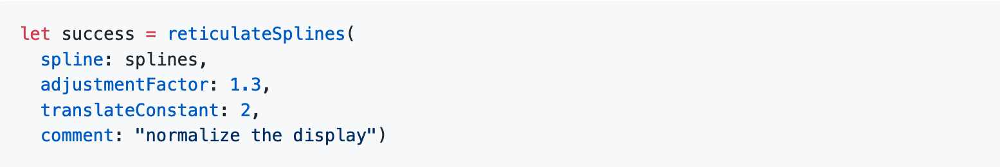 -->
Список аргументов представлен в виде колонки и имеет отступ относительно первой строки. Достаточно ли этого отступа для того, чтобы правильно отобразить логическую структуру программы? Очевидно, что нет.

Правило сходства по близости связывает список аргументов с именем переменной сильнее, чем с именем функции даже несмотря на то, что благодаря подсветке синтаксиса формируется сходство по цвету. Но что случится, если алгоритм подсветки изменится? Вот как выглядел этот же код на gitlab:

<!-- 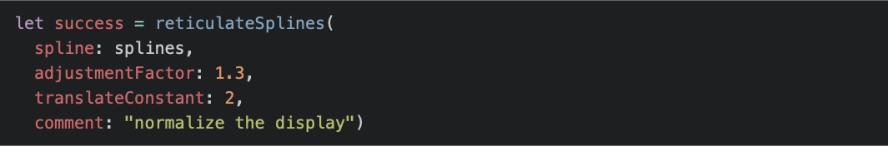 -->
В данном случае подсветка синтаксиса еще больше ухудшила ситуацию, поскольку правило сходства по цвету теперь также усиливает связь аргументов с именем переменной. Имя функции здесь как бы и ни при чем.

При сканировании текста, такое расположение провоцирует движение глаз от результирующей переменной `success` сразу к столбцу списка аргументов и только потом регрессию к имени функции.

_Подсветка синтаксиса может значительно облегчить восприятие программы. Однако, как мы видим из этого примера, в случае некорректной визуальной структуры, эффект от нее может быть совершенно противоположный. Учитывая также, что поскольку программист не контролирует подсветку синтаксиса, нельзя принимать ее во внимание при оценке того, насколько  удобочитаемым и правильно отражающим структуру программы является её конкретное визуальное представление._

Чтобы правильно отобразить логическую структуру этого кода в его визуальное представление, необходимо, чтобы список аргументов имел отступ не относительно начала строки, а относительно начала имени функции:

<!-- 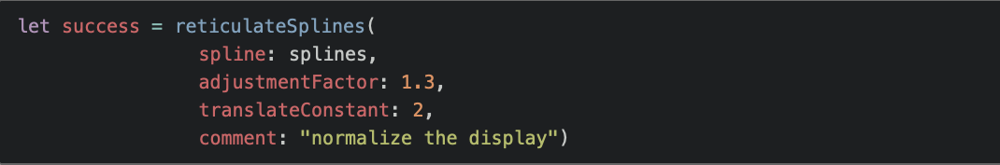 -->
В этом варианте явно видно, что список аргументов функции синтаксически является частью выражения вызова функции и логически представляет собой набор параметров, который преобразуется  посредством вызова функции.

Проведем тест с прищуриванием. Отключим также подсветку синтаксиса для того, чтобы исключить группировку по фактору сходства по окраски, которую мы не контролируем:

<!-- 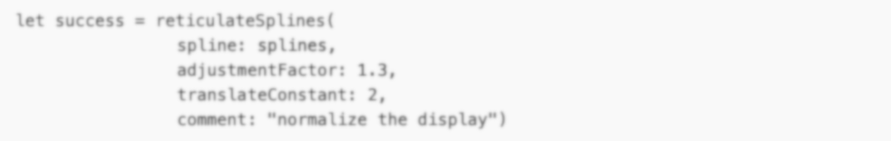 -->
Видно, что имя функции и список аргументов формируют сильно связанную область. Однако при использовании двух пробелов для отступа подчиненость списка аргументов относительно имени функции выглядит недостаточно выразительно. Использование четырех пробелов помогает решить эту проблему:

<!-- 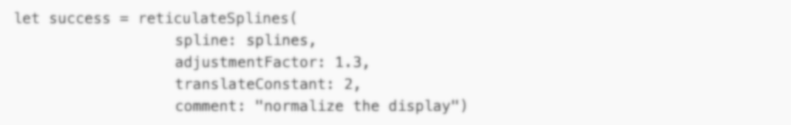 -->
Остается еще одна проблема: список аргументов выглядит как одно неструктурированное пятно, немотря на то, что в нем присутствуют два типа элементов, метки аргументов и их значения, то есть, этот список обладает определенной структурой. Для того, чтобы визуально выделить эту структуру, используем выравнивание. Для этого отвлечемся на некоторое время от этого примера и рРассмотрим различные способы форматирования списка аргументов в виде метка:значение.

**Однострочное форматирование**

<!-- 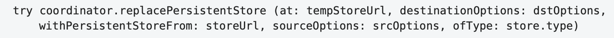 -->
В этом варианте визуальная структура не отражает структуру выражения, поэтому поиск затруднен. Этот вариант предназначен лишь для того, чтобы его тщательно читали.

Из-за большой длины строки остаток ее, не помещающийся на первой строке, был помещен на вторую. В данном случае среда разработки сделала отступ, показывающий подчиненность этой строки относительно предыдущей. Однако, в другом месте (например, в панели сравнений на gitlab) вторая строка скорее всего будет начинаться с начала и визуальная структура участка кода, включающего эту строку, будет поломана.

**Выравнивание пар метка:значение**

<!-- 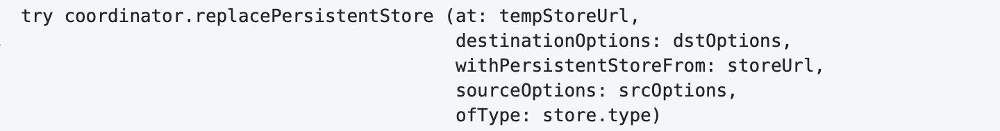 -->
Этот вариант выглядит лучше в том смысле, что в нем спецификация имени метода и список аргументов явно отделены друг от друга. Уже несколько проще поиск в списке аргументов, поскольку каждая пара располагается на отдельной строке и метки выравнены по левому краю.

Тем не менее различение меток и значений затруднено из-за того, что отсутствует явная граница между областями меток и значений для всего списка. Кроме того,  поскольку текст воспринимается как зафиксированный слева и свободный справа, в визуальном представлении этот код выглядит как большой груз (область списка аргументов), подвешенный на тонком и длинном рычаге. Основная масса кода оказывается сильно смещена в правую, менее важную часть пространства.

В данном случае можно попробовать исправить последний недостаток, сместив список аргументов влево:

<!-- 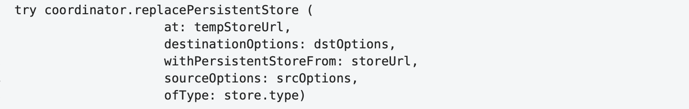 -->
Для лучшего представления внутренней структуры списка аргументов необходимо сформировать явную разделительную линию между областями меток и значений. Здесь у нас есть два варианта.

**Вариант 1: метки и аргументы выравнены влево по отдельности**

<!-- 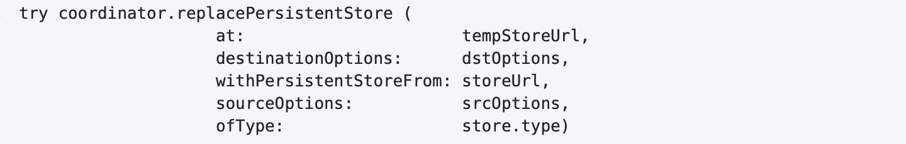 -->
Из всех предложенных до сих пор вариантов, этот наиболее точно передает логическую структуру кода. В нем явно различимы области меток и значений, идентификация и поиск отдельных элементов внутри их значительно облегчается. Однако из-за большой разницы в длинах меток аргументов связи внутри пар с короткими метками оказываются ослабленными.

**Вариант 2: внутреннее выравнивание**

<!-- 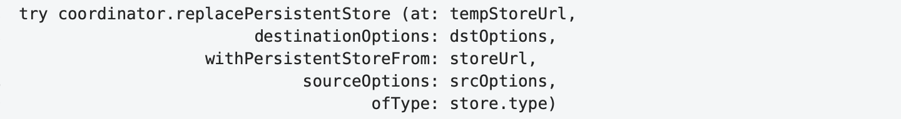 -->
Обладая всеми преимуществами предыдущего варианта, этот вариант для данного примера выглядит более естественным. В нем метки аргументов выглядят как естественное продолжение имени метода, как это и должно быть в данном случае. Код выглядит достаточно компактным и без необходимости переноса списка аргументов на следующую строку.

Для  примера с `reticulateSplines` код в этом варианте оформления будет выглядеть следующим образом:

<!-- 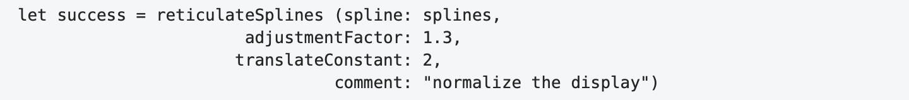 -->
Как упоминалось выше, существует некоторая асимметрия в том, как человек воспринимает левую и правую части визуальной сцены. Эта асимметрия еще более естественным образом присутствует в восприятии текста программы: текст жестко привязан к левому краю, где отступы задают уровень иерархии в логической структуре программы. Правый же край свободен и не имеет жесткого ограничения. Чтение слева направо и сверху вниз определяет то, что _что-то новое мы ожидаем увидеть сверху и слева или по центру_.

В этом смысле нельзя назвать удачными с точки зрения читаемости конструкции вида:

<!-- 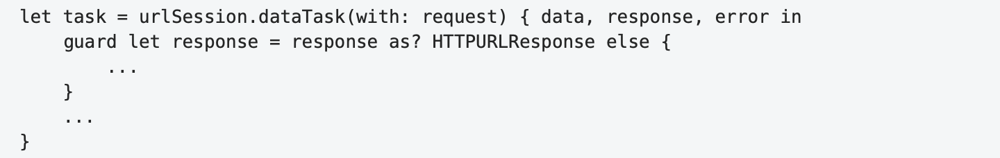 -->

В таких конструкциях новое пространство имен начинается в конце строки, то есть в области наименьшей важности, там где это начало не ожидаемо. Более естественно расположить начало этого блока кода там, где он и должен быть — вверху слева:

<!-- 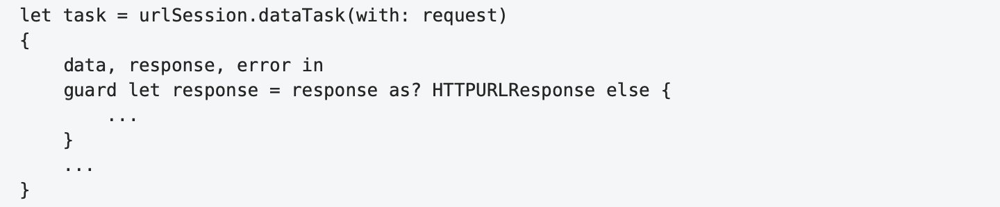 -->

<anchor>linelength</anchor>
## Длина строки
Отсутствие жесткого ограничения справа, не означает, что ограничения нет вообще. Многовековой опыт книгопечатания,[¹³](#13) и десятилетия опыта, наработанного [веб-дизайнерами](http://webtypography.net/2.1.2), сходятся к тому, что оптимальная длина строки, обеспечивающей комфортное чтение составляет приблизительно 45-75 символов.

Несмотря на структурные отличия текстов программ, трудно вообразить, что эти отличия настолько сильны, что могут сделать длинные строки, трудные для чтения обычных текстов, легкими в случае, когда мы читаем программу. Наоборот, можно ожидать, что программы, подобно научным изданиям, требуют более коротких строк, чем проза.[¹⁷](#17)

Видимо, повторяя Стива Макконнелла[¹⁴](#14), некоторые разработчики говорят, что на их больших мониторах длинные строки прекрасно помещаются, и их присутствие в коде нормально. Этот аргумент «больших мониторов» не выдерживает никакой критики:

- Длинную строку трудно охватить «широким взглядом».
- Оценка структуры выражения затруднена из-за того, что эта структура размазана по строке и не формирует явно выраженных компактных визуальных областей.
- Из-за неявно выраженной структуры и увеличения эксцентриситета затрудняется поиск.
- Из-за увеличения расстояния затрудняются переходы от конца строки к началу следующей, и соответственно замедляется чтение.

- Если отодвинуться от монитора с целью уменьшения углового размера строки, чтобы нивелировать некоторые указанные выше проблемы, это затруднит чтение за счет уменьшения размера букв и расстояний между ними. При этом это размер области идентификации и распознавания и размер саккад, измеряемых в буквах, не изменится. То есть, чтение замедлится.

- Большие мониторы не всегда доступны или текст программы может отображаться в области с гораздо меньшей шириной. При этом строка или не помещается в области видимости и требует прокрутки, либо строка разбивается на несколько строк и это, как правило, разрушает структуру программы во всей области видимости.

По ряду объективных причин не всегда можно избежать длинных строк (например, из-за использования длинных идентификаторов, которые мы не в силах изменить). Также в случаях, когда нас не интересует структура выражения (например, при выводе отладочного сообщения в лог программы), использование длинной строки может оказаться даже предпочтительнее структурирования длинного выражения разбивкой его на несколько строк, так как делает этот код менее значимым с точки зрения амбьентного зрения.

В общем же случае, длинные строки, как и длинные идентификаторы, это признак плохой читаемости кода.

<anchor>names</anchor>
## Имена
Имена играют важнейшую роль для обеспечения удобочитаемости программного кода. Они занимают его большую часть и часто играют роль маяков, позволяющих идентифицировать характерные структурные части программы. Основные требования к именам – это их краткость и выразительность. _Чем имя длиннее, тем оно труднее для чтения, запоминания и поиска._ Длинные имена, как правило приводят к длинным строкам, что тоже затрудняет чтение и поиск. Требование выразительности означает, что в области контекста использования, имя должно позволять однозначно определять роль обозначаемого им элемента программы.

Требования краткости и выразительности могут очевидным образом конфликтовать друг с другом, поскольку выразительность может требовать использования более длинных, составных имен. Поэтому имеет смысл сделать оценку допустимой рекомендованной длины имени.

В идеале, мы хотим распознавать имя с первого взгляда (при первой фиксации). Это значит, что первую оценку оптимальной длины можно заложить как размер области идентификации, то есть 10-12 символов. Особенностью текстов программ, как уже писалось выше является то, что набор допустимых слов в них ограничен, поэтому велика вероятность, что даже в случае более длинного имени мы сможем впоследствии распознавать его по первой части, так что в принципе, даже при длине больше 12 символов нам потребуется лишь одна фиксация. Мы, однако хотим, чтобы при этом это имя помещалось в размер области распознавания (17-19 символов) и оставался некоторый запас, таким образом, чтобы наш мозг имел возможность оптимально спланировать следующую саккаду. Если мы возьмем 4 символа от конца области распознавания, то получим оценку в 13-15 символов.

Допуская в редких случаях две фиксации с «угадыванием» мы получим оценку в 20-24 символа (13-15 из предыдущей оценки + 7-9 на саккаду внутри слова) .

Взяв середины отрезков полученных оценок получим следующую таблицу:

| Число фиксаций              | Оценка максимальной длины имени |
| --------------------------- | ------------------------------- |
| 1                           | 11                              |
| 1 (с угадыванием окончания) | 14                              |
| 2                           | 22                              |

Эти рекомендации достаточно хорошо согласуются с теми границами, которые приводит в своей книге[¹⁴](#14) Стив Макконнелл: 10-16 и 8-20. Теперь мы можем как-то объяснить их.

На практике иногда приходится использовать имена, длины которых выходят за предлагаемые пределы. Например, когда имя включают в себя некоторое стандартное именование группы, к которой относится данный элемент, как в `PreferencesViewController`. Располагая значимую, уникальную часть имени в начале, мы можем ожидать, что распознаем уникальную часть имени уже при первой фиксации, и в то же время нам не потребуется больших усилий для распознания «стандартного дополнения».

За редким исключением не имеет смысла использовать в именах какие-либо префиксы, описывающие некоторые общие характеристики (например тип) или для различения классов,  являющихся частью вашего приложения. Префиксы маскируют смысловую часть имени, в их присутствии позиция первой фиксации на слове при чтении сдвигается  влево от оптимальной, они требуют определенных усилий на дополнительный анализ слова. В некоторых случаях они могут изменять значение имени (`kBytesPerSec` это «килобайты в секунду» или константа `BytesPerSec`?).

Декорирование имен классов и функций имеет смысл лишь в случае разработки библиотеки на языке, в котором отсутствует понятие пространства имен, позволяющих ограничить их видимость. Все сущности, определяемые внутри вашего приложения, находятся на верхнем уровне пространства имен и, как правило, не нуждаются в каких-либо префиксах  для предотвращения конфликтов имен.

<anchor>spaces</anchor>
## Пробелы
Как указывалось выше, использование любого другого разделителя между словами  вместо пробела требует больших усилий при чтении, поскольку приводит к затруднениям при определении границ слова,  что в свою очередь затрудняет его распознавание и планирование следующей саккады.

Поэтому рекомендуется разделять идентификаторы в программе с помощью пробелов, даже в случае, если формально такого разделения не требуется. Например, имеет смысл разделять пробелом имя функции и список ее параметров/аргументов:

<!--  -->

В первой строке пробел отсутствует, и имя функции сливается с первым аргументом в  списке аргументов. Кроме затруднения в чтении, мы можем также заметить, что визуальная структура не совсем корректно отражает логическую структуру программы:  выражение вызова функции включает в себя имя функции и список аргументов, список аргументов включает в себя первый и второй аргументы. В первой же строке имя функции сильнее связано с первым аргументом, чем аргументы между собой.

Еще один пример:

<!-- 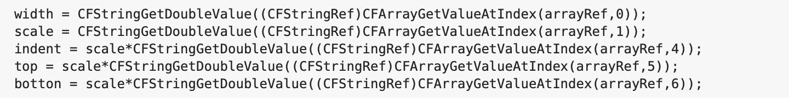 -->

После разделения на две группы, добавления пробелов и выравнивания:

<!-- 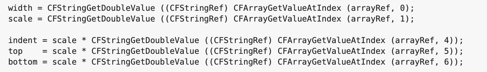 -->

В данном случае добавление пробелов не только облегчило чтение отдельных строк за счет явного разделения идентификаторов внутри их, но и (вместе с выравниванием) облегчило их сравнение, посредством образования компактных визуальны групп по вертикали. Для того, чтобы понять, что делает этот код, уже не надо читать отдельно каждую строку.

В случае, когда совокупная длина идентификаторов не превышает размера области распознавания, это требование не является настолько критическим, поскольку все выражение может быть сразу охвачено одним взглядом:

<!--  -->

<anchor>braces</anchor>
## Расстановка фигурных скобок.
На сегодняшний день в языках с Си-подобным синтаксисом существуют два основных способа расстановки фигурных скобок: _One Truce Brace Style_ (_1TBS_) и _Allman_. Остальные [известные варианты](https://en.wikipedia.org/wiki/Indentation_style) либо являются их вариациями, либо выглядят достаточно экзотически и, соответственно, популярностью не пользуются.

В _1TBS_ открывающая фигурная скобка располагается в конце строки, содержащей окончание соответствующего синтаксического элемента, с которым она связана. В стиле _Allman_, эта скобка располагается на следующей линии с тем же отступом, как и начало связанного элемента.

В общем случае стиль _Allman_ предпочтительнее, поскольку в нем открывающая и закрывающая скобки выровнены по вертикали. Это значительно облегчает поиск, например, парной открывающей скобки, поскольку требует лишь вертикального перемещения глаз. При этом на пути следования взгляда от одной скобки к другой, как правило, нет никакого текста, и поиск фактически происходит до первого символа. В _1TBS_ поиск осуществляется в широком секторе, причем взгляд проходит через текст, который надо анализировать, и который часто содержит вложенные пары фигурных скобок, что также может затруднять обнаружение нужной нам пары.

Кроме того, поскольку в стиле _Allman_ скобки располагаются на отдельных строках, блок кода внутри них визуально явно отделен от заголовка конструкции, что лучше соответствует структуре этой конструкции. В _1TBS_ такого явного разделения нет, особенно в случае, когда предшествующая часть занимает несколько строк.

Открывающая фигурная скобка является частью блока кода, который она обрамляет на пару с закрывающей скобкой; и, поскольку мы ожидаем увидеть начало нового блока слева, то естественно и открывающую скобку как символ начала нового блока, располагать слева, в начале новой строки.

Тем не менее, есть случаи, когда 1TBS может оказаться предпочтительнее, чем Allman. Например, в случае короткого условия в операторе `if`, когда код внутри скобок содержит 1-3 строки. В такой ситуации использование стиля Allman может приводить к развалу визуальной структуры кода, так что заголовок конструкции, оказывается недостаточно связанным с кодом внутри скобок по сравнению с окружающими элементами. В общем случае, можно предложить следующую эвристику: использование 1TBS стиля возможно, когда заголовок утверждения, предшествующий `{` занимает одну строку, а сама скобка расположена в левой части страницы текста и заметно левее окончания первой строки обрамляемого кода, и этот код не содержит более трех строк.

Таким образом, несмотря на то, что стиль Allman в целом выглядит предпочтительнее, выбор того или иного способа расстановки должен осуществляться программистом в каждом конкретном случае, для того чтобы сформировать оптимальное визуальное представление соответствующей части программного кода. Можно предложить следующий алгоритм действий: по умолчанию использовать стиль _Allman_, но быть готовым к тому, что в каком-то случае может потребоваться изменить его на _1TBS_, если получившийся код не достаточно ясно отражает структуру программы.

<anchor>resume</anchor>
# Заключение
Формирование удобочитаемого, то есть легкого для восприятия текста программы требует учета специфических особенностей зрения человека, таких как амбьентное и фокальное зрение, механизмов чтения текста вообще и особенностей чтения текстов программ в частности.

Легкий для восприятия текст программы обладает ярко выраженной визуальной структурой, корректно отражающей структуру программы и представляющей собой относительно компактное по горизонтали «изображение». Это изображение формируется за счет иерархического группирования логически связанных элементов программы в компактные визуальные области посредством горизонтальных отступов, добавления пустых строк и выравнивания.

Легкость чтения текста программы обеспечивается выбором оптимальных по длине и выразительности идентификаторов, явного разделения их в тексте программы с помощью пробелов.

В  своей книге о типографике[¹³](#13) Роберт Брингхерст пишет:

> Заголовки, подзаголовки, большие цитаты, сноски, иллюстрации, подписи к ним и другие включения, набираемые в разрез текста, создают своеобразные синкопы и вариации в противовес основному ритму строк… Эти вариации могут и должны вдохнуть жизнь а страницу…
>
> Чтобы книга, то есть длинный текст, была удобна для чтения, страница должна дышать в обоих измерениях.

Аналогично можно сказать,  что  структура программы, разворачиваясь в тексте сверху вниз, также обладает определённым ритмом и вариациями. Задача программиста — визуализировать этот ритм , сделать его явным в общем и в деталях.

------
<anchor>1</anchor>¹) <a href="https://www.semanticscholar.org/paper/Eye-movements-in-reading-and-information-20-years-Rayner/87c8a7be8d5e2e2209e766c3e28a3e8ee5babb64">Eye Movements in Reading and Information Processing: 20 Years of Research. Keith Rayner – University of Massachusetts at Amherst</a>
<anchor>2</anchor>²) <a href="https://researchonline.gcu.ac.uk/files/24953094/ICPC2015_authors_version.pdf">Eye Movements in Code Reading: Relaxing the Linear Order. Roman Bednarik, Bonita Sharif</a>
<anchor>3</anchor>³) <a href="http://www.ptidej.net/courses/inf6306/fall10/slides/course8/Storey06-TheoriesMethodsToolsProgramComprehension.pdf">Theories, tools and research methods in program comprehension: Past, Present and Future. Margaret-Anne Storey</a>
<anchor>4</anchor>⁴) <a href="http://www.cs.kent.edu/~jmaletic/papers/ICPC2010-CamelCaseUnderScoreClouds.pdf">An Eye Tracking Study on camelCase and under_score Identifier Styles. Bonita Sharif and Jonathan I. Maletic – Department of Computer Science Kent State University</a>
<anchor>5</anchor>⁵) <a href="https://www.researchgate.net/publication/238443707_Achieving_Software_Quality_through_Source_Code_Readability">Achieving Software Quality through Source Code Readability, Phillip Relf</a>
<anchor>6</anchor>⁶) <a href="https://ieeexplore.ieee.org/document/5328661">Relating Identifier Naming Flaws and Code Quality: An Empirical Study. Simon Butler</a>
<anchor>7</anchor>⁷) Грегори Р.Л. Глаз и Мозг. М.:Прогресс, 1970
<anchor>8</anchor>⁸) Дэвид Хантер Хьюбел. Глаз, мозг, зрение. Мир, 1970
<anchor>9</anchor>⁹) Величковский Б.М. Когнитивная наука. Основы психологии познания. Academia, Смысл, 2006
<anchor>10</anchor>¹⁰) Рудольф Арнхейм. Искусство и визуальное восприятие. М.:Архитектура-С, 2012
<anchor>11</anchor>¹¹) Ярбус А.Я. Роль глаз в процессе зрения. М.:Наука, 1965
<anchor>12</anchor>¹²) <a href="http://emipws.org/wp-content/uploads/2015/02/emip2013_report.pdf">Eye movements in programming education: analysing the expert’s gaze. Simon. University of Newcastle, Australia</a>
<anchor>13</anchor>¹³) Роберт Брингхерст. Основы стиля в типографике. М.:Дмитрий Аронов, 2006
<anchor>14</anchor>¹⁴) Макконнелл С. Совершенный код. М.:Русская редакция, 2010
<anchor>15</anchor>¹⁵) <a href="https://link.springer.com/article/10.3758/BF03206156">Saccade size in reading depends upon character spaces and not visual angle. Robert E. Morrison, Keith Rayner, 1981</a>
<anchor>16</anchor>¹⁶) Роберт Солсо. Когнитивная психология. СПб: Питер, 2002/2006
<anchor>17</anchor>¹⁷) <a href="https://www.sovsib.ru/docs/ost2912494.pdf">ОСТ 29.124–94. Издания книжные для взрослых читателей.</a>
