# Fundamentals of Optimal Code Style
### Cognitively-Oriented Approach to Improving  the Readability of Programs

###### By Aleksandr Skobelev

_At a coarse level, it’s clear that some forms of layout are better than others._
_— **Steve McConnell, Code Complete**._

## Contents

* <a href="#introduction">Introduction</a>
* <a href="#features-of-human-vision">Features of Human Vision</a>
  * <a href="#field-of-view">Field of View</a>
  * <a href="#ambient-and-focal-vision">Ambient and Focal Vision</a>
  * <a href="#the-laws-of-perceptual-organization">The Laws of Perceptual Organization</a>
  * <a href="#asymmetry-of-the-visual-field">Asymmetry of the Visual Field</a>
* <a href="#how-we-read-texts">How We Read Texts</a>
* <a href="#program-comprehension">Program Comprehension</a>
  * <a href="#cognitive-models-of-program-comprehension">Cognitive Models of Program Comprehension</a>
    * <a href="#concepts-and-terminology">Concepts and terminology</a>
    * <a href="#top-down-model">Top-Down Model</a>
    * <a href="#bottom-up-model">Bottom-Up Model</a>
    * <a href="#opportunistic-and-systematic-strategies">Opportunistic and Systematic Strategies</a>
  * <a href="#specifics-of-reading-program-texts">Specifics of Reading Program Texts</a>
  * <a href="#role-of-identifiers">Role of Identifiers</a>
* <a href="#basic-principles-of-formatting">Basic Principles of Formatting</a>
  * <a href="#building-the-visual-structure">Building the Visual Structure</a>
  * <a href="#line-length">Line Length</a>
  * <a href="#names">Names</a>
  * <a href="#spaces">Spaces</a>
  * <a href="#arranging-curly-braces">Arranging Curly Braces</a>
* <a href="#conclusion">Conclusion</a>

## Introduction

_At the risk of giving my fellow scientists good reason for displeasure, I am applying the principles in which I believe with a somewhat reckless one-sidedness, … partly because in certain cases it is useful to state a point of view with crude simplicity and leave the refinements to the ensuing play of thrust and counterthrust._
_— **Rudolph Arnheim, Art and Visual Perception**_

_First, we want to establish the idea that a computer language is not just a way of getting a computer to perform operations but rather that it is a novel formal medium for expressing ideas about methodology. Thus, programs must be written for people to read, and only incidentally for machines to execute._
_— **Harold Abelson and Gerald Jay Sussman, Structure and Interpretation of Computer Programs.**_

_Indeed, the ratio of time spent reading vs. writing is well over 10:1… Because this ratio is so high, we want the reading of code to be easy, even if it makes the writing harder._
_— **Robert C. Martin, Clean Code: A Handbook of Agile Software Craftsmanship**._

Probably no one needs to prove that the **_readability_** of the program text is one of the decisive factors that determine the success of its maintenance and development.

Usually, when evaluating the text of a program in terms of its **_ease of perception_**, the term **_readability_** is used. Strictly speaking, they are not exactly the same thing, because, as will be shown later, the process of perceiving a program is more than just reading. However, since we are talking about text, and the term **_readability_** is fairly well-established, I will also use it in that sense.

In order to maintain readability of the code, during program development it is common to agree on some common set of formatting rules (***code style***) for the source code. The very existence of a set of such rules can have a positive effect on its readability and quality, since, firstly, it forms certain habits among programmers regarding the language constructions that they expect to see in the program text, and, secondly, it forces them to be more attentive to what they have written (unless, of course, the formatting of the code is completely transferred to the auto-formatting tools).

However, individual rules are often questionable because the criteria for their selection are unclear and they often contradict similar rules in other similar styles.

The rules provide specific details for how the code is formatted to maintain readability, but there is no explanation of how the rules help achieve it. Without understanding this, the solution to the engineering problem of forming a readable (i.e optimal in the sense of perception) program text is replaced by thoughtless adherence to formal and often arbitrarily chosen rules, which usually change when moving from project to project, from language to language. As a result, a false idea is formed that the what the rules say is not so important, and the choice of one or another style is just a matter of taste and habit.

Indeed, our habits largely determine how comfortable we feel in a given situation and, in particular, how we perceive a particular formatting style. But the feeling of comfort due to habit cannot be a measure of how objectively good this style is. It is obvious that the habit of a certain style can only mean that we simply stopped noticing the specific features of this style, which in fact can be counterproductive in the sense of forming **_objectively readable_** code.

When I speak of **_objective readability_**, I mean that the full readability of a text consists of a subjective component, caused by developed habits and skills, which we talked about above, and an objective one. This second component is determined by the capabilities and limitations of the mechanisms of perception and processing of visual information common to all people in the normal mental and physical state.

Thus, the subjective component is associated with some private habits that can be changed, and the objective – with the general psychophysical features of a human's vision, which we do not assume is possible to change. Therefore, when talking about optimizing the text of a program, it makes sense to talk only about the objective component of readability, and therefore further in this article the term **_readability_** will always refer to this component of it.

Let's take a closer look at what we know about the mechanisms of human perception of visual information, reading plain texts, and reading and perceiving program texts.

## Features of Human Vision[¹](#fn-1)
### Field of View
The human [field of view](https://www.ncbi.nlm.nih.gov/books/NBK220/) is relatively large: 50° superiorly, 60° inferiorly, 90° temporally (towards an ear) and 50° nasally. Situated in the temporal hemifield is the normal blind spot approximately 12 to 17 degrees from fixation and 1.5 degrees below the horizontal meridian. Within this field, visual acuity and color perception are unevenly distributed: visual acuity of the order of 1' is achieved in the area of ​​**_fovea_**, which forms ~2° of central (**_foveal_**) vision, but it is not so good in the **_parafoveal_** area (which covers 5° in both directions from the fixation point) and even worse at the periphery.[⁵](#fn-5)

Likewise, the ability to distinguish colors decreases from the center to the edge, and this change is different for different color components. We can say that moving from the center of the human retina to the periphery, we seem to find ourselves in earlier stages of evolution, moving from the most highly organized structures to the primitive eye, which distinguishes only the simple movement of shadows.

**Figure 1. Field of view of the human right eye. Orange spot - the place of projection of the fundus blind spot.([orig.](https://ru.wikipedia.org/wiki/%D0%9F%D0%BE%D0%BB%D0%B5_%D0%B7%D1%80%D0%B5%D0%BD%D0%B8%D1%8F#/media/%D0%A4%D0%B0%D0%B9%D0%BB:Goldmann_visual_field_record_sheet.svg))**

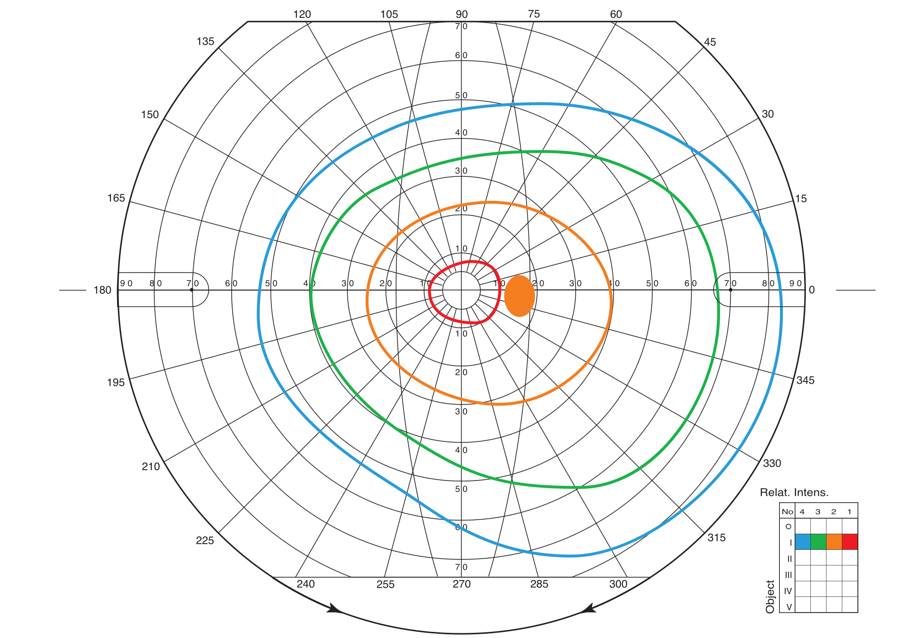

<!--  -->

### Ambient and Focal Vision
In modern neuropsychology, there is a concept of **_ambient_** (from the French ***ambiant*** ‘surrounding’) and **_focal_** visual systems. While the first, evolutionarily more ancient, is responsible for dynamic spatial localization, the second deals with the identification of objects.

**Table. 1. Comparative features of focal and ambient systems**
| Visual System          | Focal | Ambient         |
|------------------------|-------|-----------------|
| Function               | What  | Where / How     |
| Engagement in movement | Less  | More            |
| Awareness / Memory     | More  | Less or missing |
| Temporary properties   | Slow  | Fast            |
| Light Sensitivity      | High  | Low             |
| Spatial resolution     | High  | Low             |

The objects that represent the source of the necessary information are far unevenly distributed. They are usually localized in small areas of the visual field. With the help of ambient vision, a potentially interesting object or element of the object is detected, and with the help of focal vision aimed at the object, this information is perceived and analyzed in more detail. When faced with a new situation or with a new object, we, as a rule, first look "wide field" and only then concentrate our attention on details.

Examination of the environment and selection of objects for detailed processing is carried out using head and body movements, which are superimposed on a subtle pattern of eye movements. The most famous of their varieties are **_saccades_** — extremely fast (~ 500°/sec) jumps of a ballistic type, changing the position of the eyes in orbit and making it possible to highlight fragments of the scene for subsequent **_fixation_**.

**Figure 2. Reproduction of Ilya Repin's painting and recording of the subject's eye movements.**[²](#fn-2)

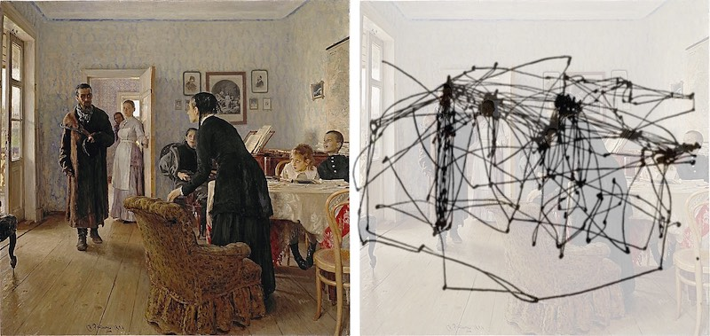

<!--  -->
Studies of the relationship between ambient (global) and focal (local) visual processing began in the experiments of David Navon in 1977. He presented subjects with large letters consisting of small letters. Some of these compound stimuli were "homogeneous" – the global form and local elements were the same letter. Others were "heterogeneous" – the global and local letters were different (say, "E" and "S"). The subjects had to identify the global or local letter as quickly as possible.

**Figure 3. Homogeneous and heterogeneous super letters from David Navon's experiments.**

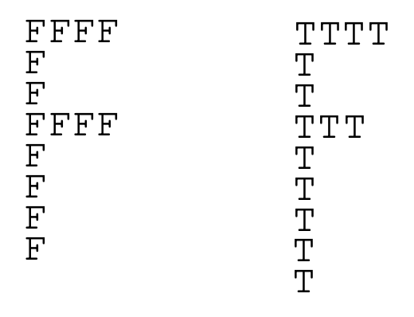

<!--  -->

It turned out that when set to the global form, it is identified quickly and without any interference with matching or non-matching letters of the local level. When set to identify parts (i.e. small letters), the picture was different. First, the responses were slower. Second, in the case of heterogeneous stimuli, responses were further slowed down and become less accurate. Obviously, _when we set ourselves up for granularity, we cannot always ignore global information_.

Research on the relationship of global and local processing, tested with the Navona super letters, revealed a possible differential role for the posterior left and right hemispheres of the brain. In this case, the left hemisphere turned out to be more of a tuning regulator for details, and the right one for global outlines. The influence of emotions turned out to be extremely interesting: negative emotions, in contrast to positive ones, strengthened the attitude towards the perception of details.

### The Laws of Perceptual Organization
An interesting feature of our vision is the ability to perceive a group of objects as a whole. So in the image below we see a dog, and not just a chaotic set of spots:

**Figure 5. Dalmatian.**

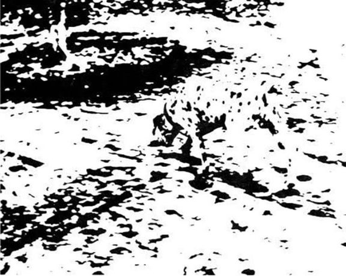

<!--  -->
And here we clearly see a square and a circle:

**Figure 6. Shapes from points.[⁴](#fn-4)**

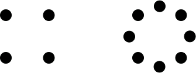

<!--  -->
There are many explanations for these illusions. In terms of cognitive bionomy, the need to see shapes, edges, and movements (as well as faces) was dictated by the need for survival. Thus, even in the absence of real lines or shapes, our sensory-cognitive system used partial information to create these shapes in an attempt to make the seemingly chaotic world intelligible.

Take a look at the picture below and you will see how, over time, the orientation of the triangles changes from one direction to another, a third.

**Figure 7. Triangles changing orientation.[³](#fn-3)**

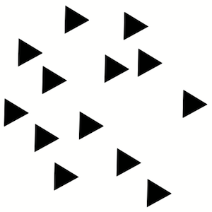

<!--  -->
Thus, we can say that _in the absence of a clearly expressed dominant structure, our brain is constantly spending resources in search of such a structure_.

Gestalt psychologists were the first to study this phenomenon of perceptual organization. They formulated the basic law of visual perception, according to which _any stimulating model is perceived in such a way that the resulting structure will be, as far as the given conditions allow, the simplest_. Therefore, we perceive the square exactly as it is depicted on the left, and not in some other way:

**Figure 8. Options for organizing points into a shape.[⁴](#fn-4)**

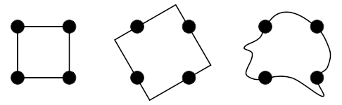

<!--  -->

Gestalt psychologists have also formulated 6 principles of perceptual organization. In accordance with these principles, _objects that_

- _located close to each other ("the law of proximity"),_
- _have similar brightness and color characteristics ("similarities"),_
- _restrict a small, closed ("closed")_
- _and a symmetric area ("symmetry"),_
- _naturally continue each other ("good continuation"),_
- _move at approximately the same speed in one direction ("common destiny"),_

_will sooner be perceived as a whole, or a figure, and not as disparate elements of the environment, or background_.

**Figure 9. Examples of similarity in proximity, color and size.[⁴](#fn-4)**

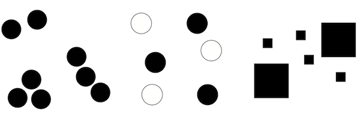

<!--  -->

In the case of competition of several factors of perceptual organization, the priority is usually given to the factor of _proximity_, and then the factor of similarity in _color_, _orientation_ or _size_.

Taking these principles into account turns out to be important in the case of perceptual search or perception, because, _if information is organized in accordance with these principles, the solution of the problem posed requires less effort due to the fact that the perceptual field is subjected to grouping, and a smaller proportion of common resources are successively allocated to the formed groups of elements_. The distribution of resources within each group is approximately equal.

The tasks of visual search are usually complicated by the addition of irrelevant objects (_distractors_). However, _in the case when distractors form visually compact groups, allowing them to be ignored as a whole, their addition, on the contrary, can greatly facilitate the search_.

### Asymmetry of the Visual Field
Similar to the asymmetry between the left and right hand, there is some asymmetry in how we perceive the left and right visual fields. Perhaps this is also due to asymmetries in the left and right hemispheres of the brain, which are responsible for processing sensory information from the right and left visual fields, respectively.

Thus, in the scenic arts it is known that there is a difference between the left and right halves of the stage: when the curtain rises in the theater, the audience is inclined to look to its left first and to identify with the characters appearing on that side. Therefore, among the so-called stage areas the left side (from the audience's viewpoint) is considered stronger. In a group of actors, the one farthest left dominates the scene. The audience identifies with him and sees the others, from his position, as opponents. Likewise the observer experiences a picture as though he were facing its left side. He subjectively identifies with the left, and whatever appears there assumes greatest importance.[⁴](#fn-4) Thus, in addition to the natural balance point in the center of the visual scene, an additional center is formed in its left part.

## How We Read Texts[⁵](#fn-5)

When we read, our eyes incessantly make rapid mechanical (i.e., not controlled by consciousness) movements, **_saccades_**. On average, their length is 7-9 letter spaces. At this time we do not receive new information. 

The primary function of a saccade is to bring a new region of text into foveal vision (~2° central field of view) for detailed analysis, because reading on the basis of only parafoveal or peripheral information is difficult to impossible.

Between saccades, our eyes remain relatively motionless for the duration of **_fixations_** (about 200 – 300 ms). During this period, we recognize the visible part of the text and plan where to make the next jump.

**Figure 10. Typical pattern of eye movements while reading.[¹](#fn-1)**

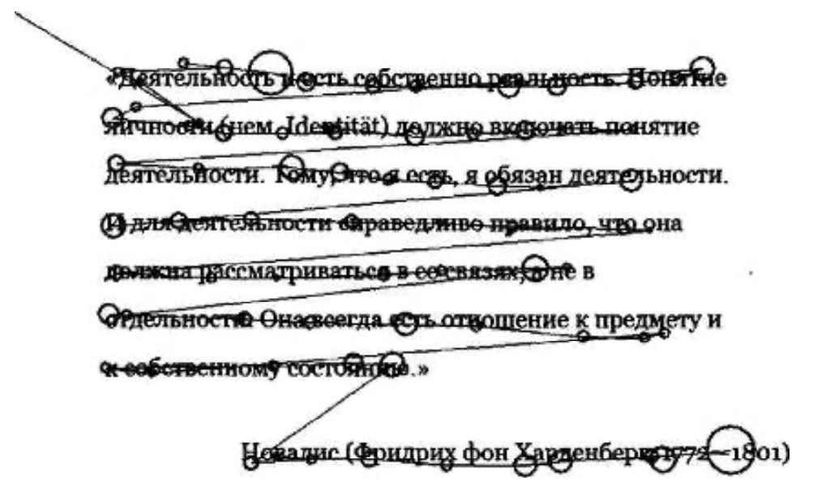

<!--  -->

**Table 1. Approximate Mean Fixation Duration and Saccade Length in Reading, Visual Search, Scene Perception, Music Reading, and Typing**

| Task             | Mean fixation duration (ms) | Mean saccade size (degrees) |
|------------------|-----------------------------|-----------------------------|
| Silent reading   | 225                         | 2 (about 8 letters)         |
| Oral reading     | 275                         | 1.5 (about 6 letters)       |
| Visual search    | 275                         | 3                           |
| Scene perception | 330                         | 4                           |
| Music reading    | 375                         | 1                           |
| Typing           | 400                         | 1 (about 4 letters)         |

Letter spaces are the appropriate metric to use, because the number of letters traversed by saccades is relatively invariant when the same text is read at different distances, even though the letter spaces subtend different visual angles.[⁷](#fn-7)

Whereas a majority of the words in a text are fixated during reading, many words are skipped so that foveal processing of each word is not necessary.

About 10-15% of the time, readers move their gaze back in the text (**_regressions_**) in order to re-read what has already been read. As the difficulty of the text increases, the duration of fixations and the frequency of regressions increase, and the length of saccades decreases.

During fixation, we get information from the **_perceptual span_**. The size of this area is relatively small, in the case of alphabetic orthographies (for example, in European languages) it starts from the beginning of the fixed word, but no more than 3-4 letter spaces to the left of the fixation point, and extends to about 14-15 letter spaces to the right of this point (in total 17-19 spaces).

The **_identification span_**, that is, the scope required to identify a fixed word, is less than the perceptual span and, as a rule, does not exceed 7-8 letter spaces to the right of the fixation (in total, about 10-12 spaces).

The availability of the first three letters of a word during the previous fixation leads to a decrease in the fixation time on that word. Some researches have also shown that the letter information to the right of the fixation can be used to determine whether the next word should be skipped.

Most of the research suggests that boundary information (conveyed by the spaces between words) is the major determinant used in deciding where to move to next; saccade length is influenced by both the length of the fixated word and the word to the right of fixation.

Most readers are slowed down (on average by about 30%) by the absence of space information, and experiments demonstrated that _both word identification processes and eye guidance are disrupted by the lack of space information_.

It was found that, when space information is provided for readers of Thai (who are not used to reading with spaces between words), they read more effectively than normal. There are reports that the reading of long German compound words is facilitated by the insertion of spaces, even though this format is ungrammatical and never encountered in normal reading.

_Thus, it appears safe to conclude that space information is used for guiding the eyes in reading._

Word-length information may be used not only in determining where to fixate next but also in how parafoveal information is used. That is, enough parafoveal letter information may be extracted from short words so that they can be identified and skipped, whereas partial-word information (the first three letters) extracted from longer parafoveal words may rarely allow full identification of them but facilitate subsequent foveal processing.

Word-length information also plays a clear role in where in the word a reader fixates. Although there is variability in where the eyes land on a word, readers tend to make their first fixation on a word about halfway between the beginning and the middle of a word.

Word-length information helps to guide the eye toward ***the preferred viewing location***, i.e. a location between the beginning and the middle of the word. When the space indicating the location of word n+1 was visible in the parafovea, the first fixation on that word was closer to the preferred viewing location than when the parafoveal preview did not contain that space information.

Although the average landing position in a word lies between the beginning and middle of a word, this position varies as a function of the distance from the prior launch site. For example, if the distance to a target word is large (8-10 letter spaces), the landing position is shifted to the left. Likewise, if the distance is small (2-3 letter spaces), the landing position is shifted to the right.

The location of the first fixation is between the beginning and the middle of a word for words that are 4-10 letters long (either for the first fixation in a word or when only a single fixation is made). However, with longer words, the effect breaks down, and readers tend to fixate near the beginning of the word and then make a second fixation toward the end of the word.

Informational density (or morphological structure) of the word influences how long the fixations are on each half of the word. For example, it was found that if the word was predictable from the first 6 letters (the words were typically about 12 letters), readers generally made a fixation in the first half of the word and then moved their eyes to the next word; if they made a second fixation on the word it tended to be quite short. However, if the word could only be identified by knowing what the ending was, readers typically made a short fixation at the beginning followed by a longer fixation on the end of the word.

With respect to visual search task it was found that when the target was at a small **_eccentricity_**, it was located accurately with a single saccade; when the target was more peripheral, wrongly directed initial saccades were common (up to 40% of the time). Also _in a complex search tasks the eyes is initially directed to the center of the global display and then to the centers of recursively smaller groups of objects until the target was acquired_.

## Program Comprehension

Programs differ from natural language texts in two important ways. First, programs are lexically and syntactically different from natural language texts. Lexically, they are composed from a limited vocabulary, with some words used as programming language keywords, and others used more freely as identifiers to name program constructs like variables and methods. Syntactically, programs are laid out and organized differently than natural language texts. They feature greater use of formally defined structures and multiple forms of indented layout (both horizontal and vertical). The second difference is semantic. Natural language text is typically understood in two concurrent phases: text (how it is written down) and domain (what it means). Source code comprehension however needs a third dimension of comprehension: execution. Thus, in order to understand a program’s goals, programmers must be able to trace source code execution to discover its operational semantics.[⁶](#fn-6)

### Cognitive Models of Program Comprehension[⁸](#fn-8)

#### Concepts and terminology
A **_mental model_** describes a developer's mental representation of the program to be understood whereas a _cognitive model_ describes the cognitive processes and temporary information structures in the programmer’s head that are used to form the mental model. 

**_Programming plans_** are generic fragments of code that represent typical scenarios in programming. For example, a sorting program will contain a loop which compares two numbers in each iteration.

**_Delocalized plans_** – programming plans realized by lines scattered in different parts of the program. Delocalized plans complicate program comprehension.[¹⁰](#fn-10)

**_Beacons_** are recognizable, familiar features in the code that act as cues to the presence of certain structures.

**_Rules of programming_** discourse capture the conventions of programming, such as coding standards and algorithm implementations. 
<!-- These rules form certain expectations in the mind of the programmer. -->

#### Top-Down Model
In this model, it is assumed that programmers understand a completed program in a top-down manner where the comprehension process is one of reconstructing knowledge about the domain of the program and mapping this knowledge to the source code. The process starts with a hypothesis about the general nature of the program. This initial hypothesis is then refined in a hierarchical fashion by forming subsidiary hypotheses. Subsidiary hypotheses are refined and evaluated in a depth-first manner. The verification (or rejection) of hypotheses depends heavily on the absence or presence of beacons.

Top-down understanding is used when the code or type of code is familiar; expert programmers use beacons, programming plans and rules of programming discourse to decompose goals and plans into lower-level plans.

#### Bottom-Up Model
The bottom-up theory of program comprehension assumes that programmers first read code statements and then mentally chunk or group these statements into higher level abstractions. These abstractions (chunks) are aggregated further until a high-level understanding of the program is attained.

#### Opportunistic and Systematic Strategies
With these strategies, programmers either systematically read the code in detail, tracing through the control-flow and data-flow abstractions in the program to gain a global understanding of the program, or that they take an as-needed approach, focusing only on the code relating to a particular task at hand.

Subjects using a systematic strategy acquire both static knowledge (information about the structure of the program) and causal knowledge (interactions between components in the program when it is executed). This enabled them to form a mental model of the program. Those using the as-needed approach only acquire static knowledge resulting in a weaker mental model of how the program worked. More errors occurre since the programmers fail to recognize causal interactions between components in the program.

### Specifics of Reading Program Texts
A comparative study of the linearity of program reading by novices and experts[⁶](#fn-6) showed that novices read source code less linearly than natural language text. Moreover, experts read code less linearly than novices. These findings indicate that there are specific differences between reading natural language and source code, and suggest that non-linear reading skills increase with expertise.

Below, as an example, giving an idea of ​​the difference in reading ordinary texts and program texts, the results of one experiment[¹¹](#fn-11) on the analysis of the eye movements of programmers while reading the code are presented.

**Figure 11. Traces of eye movement of two expert programmers when reading the same code.**
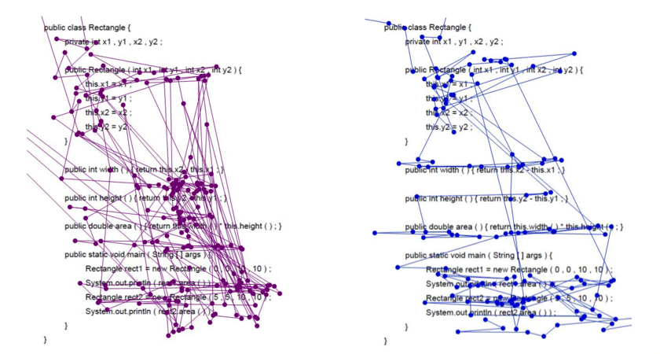
<!--  -->

The programmers were given different tasks: the first (left figure) was expected to receive an answer, what is the return value of `rect2.area()`, the second was told that he would be given a multiple choice question about the algorithmic idea.

As we can see, these scanpaths are quite different, however, the differences in gaze appear deeper than this difference in what they were expecting to be asked, and suggest that different readers read code in markedly different manners.

According to the authors, reader 1’s gaze might politely be described as erratic. Considered in real time, it flashes wildly about the code, generally spending very little time on any one point. Viewed over time, there is a clear pattern of returning to certain focal points, points that are pertinent to the question that the reader was told to expect; but the gaze fixations are so brief as to leave the analyst wondering whether it is possible to gain any comprehension of the code.

Reader 2, by contrast, appears to read the code slowly and methodically. There are elements of linear scanning, and gaze remains far longer on areas of interest.

Indeed, in the illustration on the left, we observe a rather chaotic trajectory with a large number of long vertical saccades, and on the right, there are mainly horizontal saccades, most of which can be associated with reading the text in a general sense.

We can say that in the first case, we see the dominance of fast ambient vision, characterized by long saccades and short fixations, and in the second, slow focal vision.

The authors describe the following basic types of eye movements that make up more complex code reading strategies:

**Table 3. Basic types of eye movements when reading code.**
| Type                  | Description                                                                                                                                                             |
|-----------------------|-------------------------------------------------------------------------------------------------------------------------------------------------------------------------|
| Flicking              | The gaze moves back and forth between two related items, such as the formal and actual parameter lists of a method call.                                                |
| JumpControl           | Subject jumps to the next line according to execution order.                                                                                                            |
| JustPassingThrough    | Fixations are on a blank spot and clearly just stop on the way to some place else.                                                                                      |
| LinearHorizontal      | Subject reads a whole line either from from left to right or right to left, all elements in rather equally dis- tributed time.                                          |
| LinearVertical        | Subject follows text line by line, for at least three lines, no matter of program flow, no distinction between signature and body.                                      |
| RetraceDeclaration    | Often-recurring jumps between places where variable is used and where it had been declared. Form of Flicking.                                                           |
| RetraceReference      | Often-recurring jumps between places where variable is used and where it had been recently referred to. Form of Flicking.                                               |
| Scan                  | Subject first reads all lines of the code from top to bottom briefly. A preliminary reading of the whole program, which occurs during the first 30% of the review time. |
| Signatures            | Subject looks at all signatures first, before looking into method/constructor body.                                                                                     |
| Thrashing             | The gaze moves rapidly and wildly in a sequence that appears to make no particular sense.                                                                               |
| Word(Pattern)Matching | Simple visual pattern matching.                                                                                                                                         |

### Role of Identifiers[⁹](#fn-9)
The comprehension of identifier names in programs is at the core of program understanding. Identifier names are often key beacons to program plans that support higher-level mental models of understanding. Identifiers make up approximately 70% of source code. If a certain identifier naming style significantly increases the speed of code comprehension, this could significantly impact overall program understanding.

In general, using actual words rather than abbreviations lead to better comprehension. Identifiers that violate certain guidelines have lower code quality (more bug patterns) than ones that don’t. Longer names reduce correctness and take longer to recall.

In an eye-tracking study analyzing the effect of identifier style (camel-case and underscore) on accuracy, time, and visual effort, with respect to the task of recognizing a correct identifier in a phrase, it was shown that, although, no difference was found between identifier styles with respect to accuracy, results indicate a significant improvement in time and lower visual effort with the underscore style.

**Figure 12. Part of two gaze plots for the correct underscore (left) and camel-cased (right) versions of the 3-word code identifier[⁹](#fn-9)**

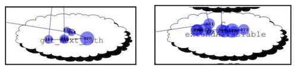

<!--  -->

## Basic Principles of Formatting

### Building the Visual Structure
A priori, we know that a program has a certain logical and syntactic structure, and we expect that the structure of its visual representation will reflect them accordingly.

As mentioned above, our brain is in constant search for some optimal interpretation of the visual scene, which allows us to explain it in the simplest way. Therefore, it can be asserted that the more clearly the visual structure is formed, and the more accurately it reflects the structure of the program, the less mental effort we will spend on the perception of this program.

When we visually perceive the program, we get the first impression and evaluate the visual structure of the text mainly due to ambient vision, which has low acuity and color perception, deteriorating from the center to the edge. Fast ambient vision helps us to highlight points of interest in the code for further analysis and reading using slow focal vision. This means that, speaking about the general visual structure of the program text, we must move from the domain of ​​focal vision, that is, from letters and symbols, to the domain of ​​ambient vision, that is, to  ​​spots and the relationships between them.

The sequence of the main structural elements in the program is developed in the vertical direction, so when evaluating the overall visual structure of the program, when covering it with a "wide view", vertical eye movement prevails, accompanied by small horizontal deviations. The horizontal movement of the gaze associated mainly with the transition to focal vision and reading directly allows us to get the details of these elements.

Therefore, for a correct assessment of the overall structure of the program, it is important to form the correct visual structure in the vertical direction.

For example, in a function definition, we need to visually separate the function declaration, including its name, return type, parameter list, and function body. Inside the body of the function, it is necessary to separate the initialization code of the initial variables, the body of the main algorithm, the formation and return of the result. In turn, within the initialization code, we need to separate the scope of types, variable names, and values ​​assigned to them.

Consider the following example:

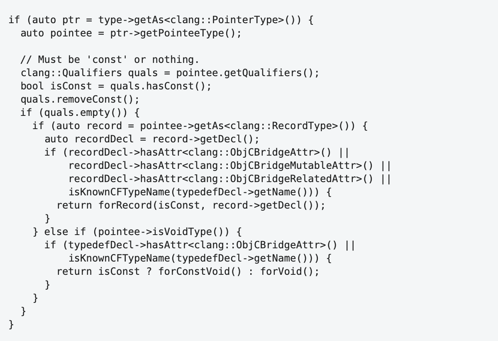

To analyze the visual structure, let's make a test similar to the _squint test_ used by the UI designers. Alan Cooper describes this test in his book as follows[¹⁴](#fn-14):

> *Close one eye and squint at the screen with the other eye to see which elements pop out, which are fuzzy, and which seem to be grouped. Changing your perspective can often uncover previously undetected issues in layout and composition.*

In fact, by squinting, we are trying to gauge how we perceive an image through ambient vision. Instead of squinting, you can try to look at the code with a defocused gaze and somewhat away from the fragment of interest.

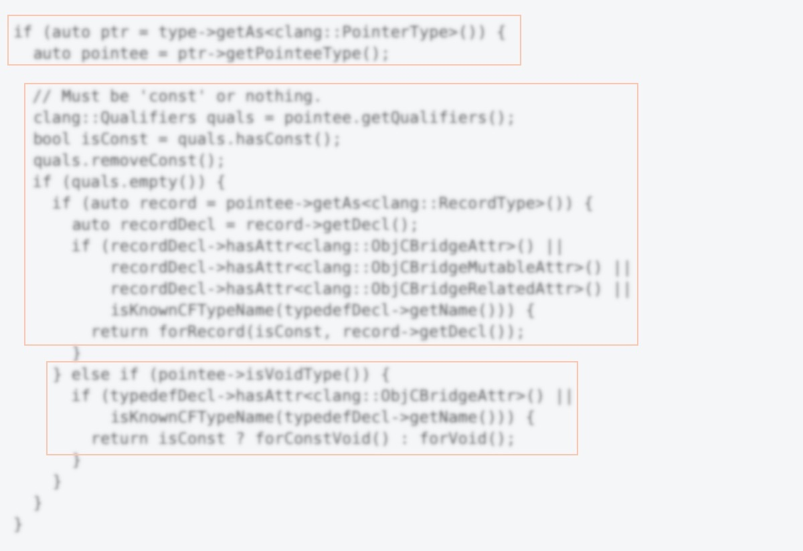

The visual structure of this code contains only three large areas, which obviously does not reflect the program structure correctly.

Stacking vertically allows you to correct this defect:

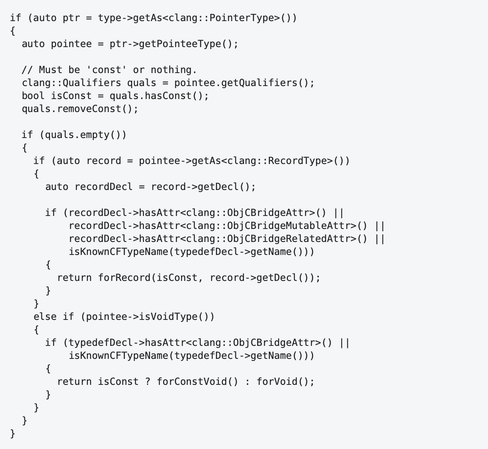

<!--  -->

The squint test of it:

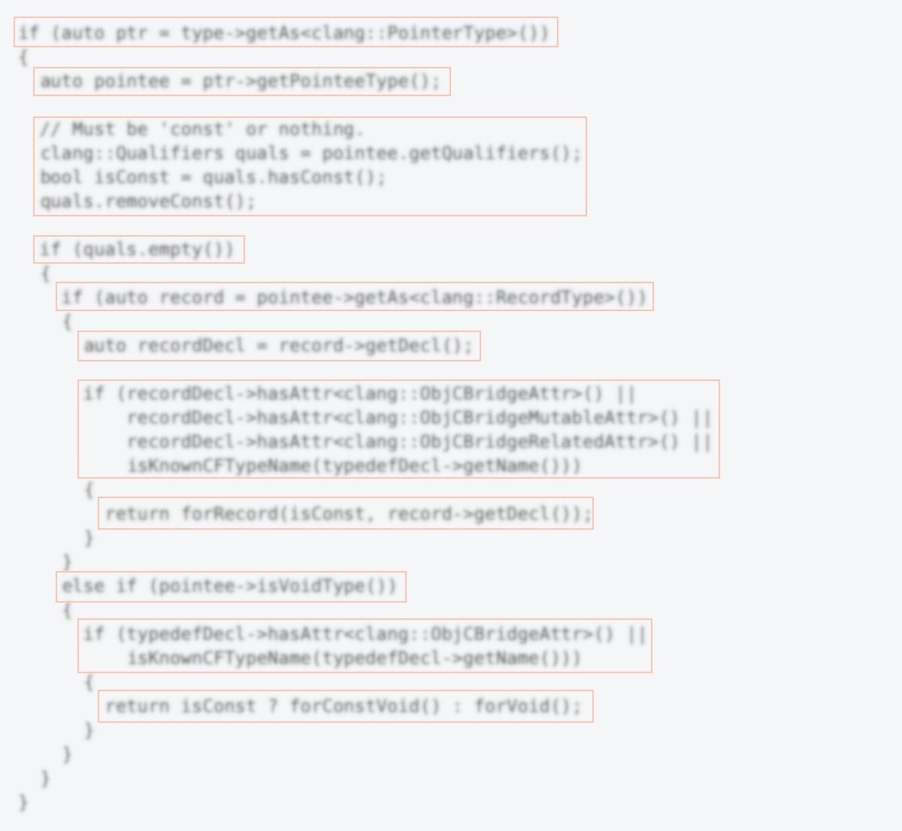

<!--  -->

Regions of text can be composed of lines of the same structure. In this case, it makes sense to group the same line elements, thereby emphasizing their horizontal structure. This grouping will highlight the common and make the differences more visible.

This way we structure the text both vertically and horizontally. In the first case, we perform these splits by adding blank lines. In the second, we use indentation and alignment.

Indents are used to form a visual representation of the hierarchy in the program structure between elements on different lines.

Let's take a look at the following code:

<!--  -->

The list of arguments is presented as a column and is indented relative to the first line. Is this indentation sufficient to correctly display the logical structure of the program? Obviously not.

The proximity rule binds the argument list to the variable name more strongly than to the function name, even though syntax highlighting creates a color similarity. But what happens if the highlighting algorithm changes? Here's what the same code looked like on gitlab:

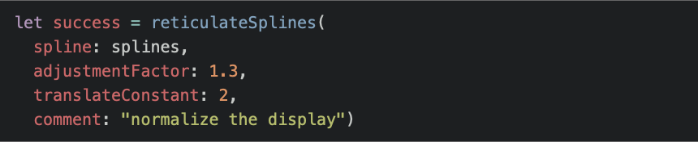

<!--  -->

In this case, syntax highlighting made things worse, since the color similarity rule now also strengthens the association of arguments with a variable name. The function name has nothing to do with it.

When scanning text, such an arrangement provokes eye movement from the resulting variable `success` directly to the column of the list of arguments and only then regression to the function name.

_**Syntax highlighting** can greatly facilitate the perception of the program. However, in the case of an incorrect visual structure, the effect of it can be completely opposite. Considering also that since the programmer has no control over the syntax highlighting, it **should not be taken into account when assessing whether program's particular visual representation is readable and correctly reflects its structure**._

To correctly display the logical structure of this code in its visual representation, it is necessary that the list of arguments is indented not relative to the beginning of the line, but relative to the beginning of the function name:

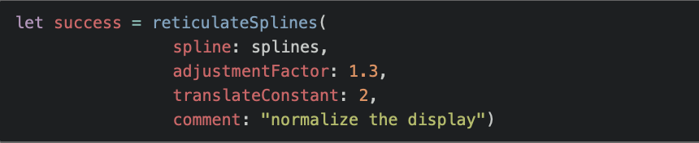

<!--  -->

In this case, it is clearly seen that the function argument list is syntactically part of the function call expression and is logically a set of parameters that is accepted by the function.

Let's do a squint test. We will also disable syntax highlighting in order to exclude grouping by the color similarity factor, which we do not control:

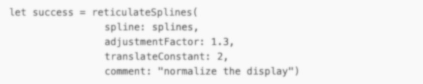

<!--  -->

You can see that the function name and argument list form a tightly coupled scope. However, when using two spaces for indentation, the subordination of the argument list relative to the function name does not seem expressive enough. Using four spaces helps to solve this problem:

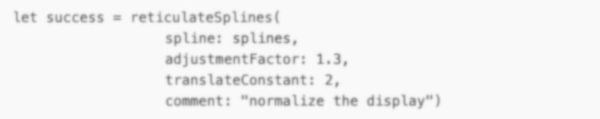

<!--  -->

One more problem remains: the list of arguments looks like one unstructured spot, despite the fact that there are two types of elements, the labels of the arguments and their values. This list has a certain structure, and in order to visually highlight this structure, we should use alignment. But before that, let's digress from this example for a while and look at various ways to format an argument list as label:value.

**One line formatting**

<!--  -->

In this version, the visual structure does not reflect the structure of the expression, so the search is difficult. This option is only intended to be read carefully.

Due to the large length of the line, the rest of it, which did not fit on the first line, was placed on the second one. In this case, the editor made an indent showing the subordination of this line relative to the previous one. However, elsewhere (for example, in the comparison pane on gitlab), the second line will most likely start at the beginning and the visual structure of the piece of code will be broken.

**Label:value pairs alignment**

<!--  -->
This option looks better in the sense that the method name and the argument list are clearly separated from each other. It is already a little easier to search in the argument list, since each pair is on a separate line and the labels are left aligned.

However, distinguishing between labels and values ​​is difficult because there is no clear border between label and value areas for the entire list. In addition, since the text is perceived as anchored on the left and free on the right, visually this code appears as a large mass (the area of ​​the argument list) suspended from a thin and long arm. The bulk of the code turns out to be strongly shifted to the right, less important part of the space.

In this case, we can try to fix the last flaw by shifting the list of arguments to the left:

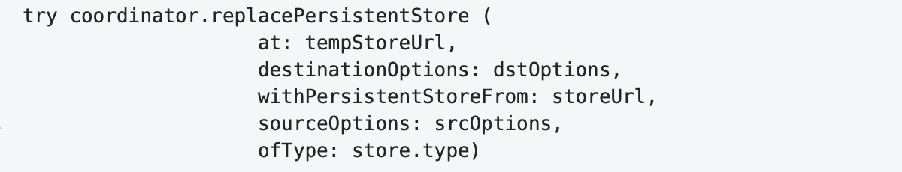

<!--  -->
To better represent the internal structure of the argument list, it is necessary to form an explicit dividing line between the label and value areas. We have two options here.

**Option 1: labels and arguments are left aligned separately**

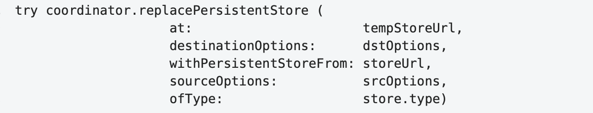

<!--  -->
Of all the options proposed so far, this one most accurately conveys the logical structure of the code. It clearly distinguishes the areas of labels and values, identifying and finding individual elements within them is much easier. However, due to the large difference in the label lengths of the arguments, the bonds within pairs with short labels are weakened.

**Option 2: inner alignment**

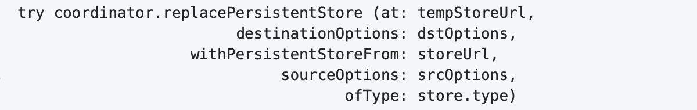

<!--  -->
Having all the advantages of the previous option, this option looks more natural for this example. In it, the argument labels look like a natural continuation of the method name, as it should be in this case. The code looks compact enough without the need to carry the argument list to the next line.

For the `reticulateSplines` example, the code in this styling would look like this:

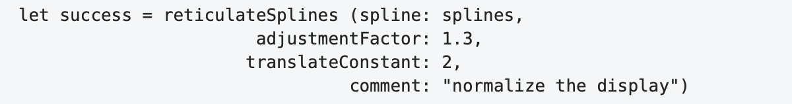

<!--  -->
Alignment is a powerful tool for optimizing the visual presentation of code by forming compact groups in a horizontal direction.

Let's analyze the following code:

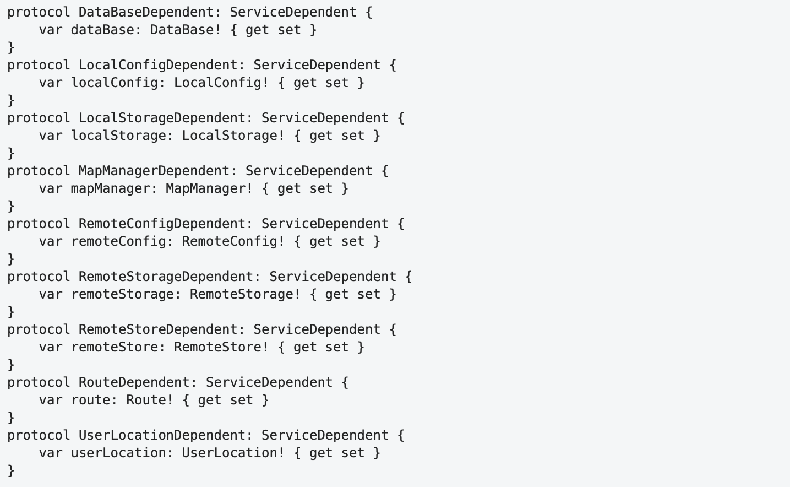

<!--  -->

Basically, every single protocol declaration looks reasonably readable. However, this cannot be said about the entire text: the general structure is inexpressive, there are no clearly expressed masses in it that could attract the eye. As a result, "dazzles in the eyes", and there is a feeling of tiring monotony. To perceive this code, it can only be read sequentially and completely: _"protocol DataBaseDependent ServiceDependent var dataBase DataBase get set, protocol LocalConfigDependent …"_

Let's reformat it so that each declaration spans one line and align it:

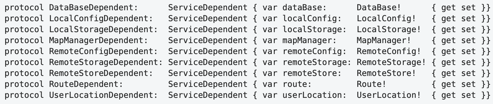

<!--  -->

Now clearly defined groups (grouping by "proximity") have been formed in the horizontal direction, and the structure of each definition and the differences between them have been clearly revealed. The way this code is read is also different. After a quick initial familiarization with the structure and identifying common parts, further analysis simply ignores these common parts, and attention is focused only on the different parts. Thus, due to the more active use of ambient vision, the load on the focal vision is reduced and the amount of mental effort required to understand the program is reduced.

As mentioned above, there is some asymmetry in how we perceive the left and right sides of the visual scene. This asymmetry is even more natural in the perception of the program text: the text is rigidly anchored to the left margin, where indents set the level of hierarchy in the logical structure of the program. The right edge is free and does not have a hard limit. Reading from left to right and top to bottom determines that _everything new we expect to see top and left or center_.

Because of that, the following constructions cannot be called good in terms of readability:

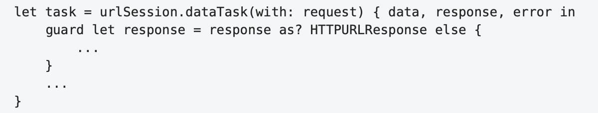

<!--  -->

In such constructs, the new namespace begins at the end of the line, that is, in the least important area, where this beginning is not expected. It's more natural to place the beginning of this block of code where it should be — at the top left:

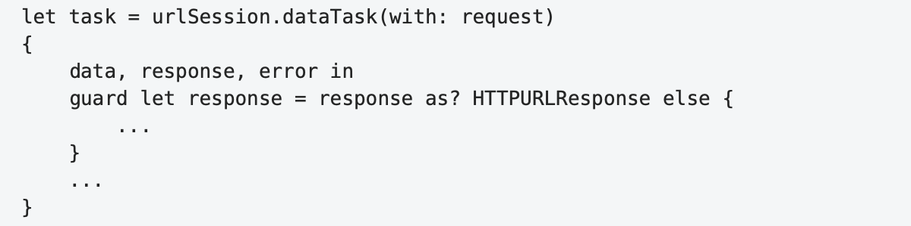

<!--  -->

### Line Length
The absence of a hard constraint on the right does not mean that there is no constraint at all. Centuries of typography[¹²](#fn-12) and decades of [web designers](http://webtypography.net/2.1.2) experience agree that the optimal line length for comfortable reading is approximately 45-75 characters.

Despite the structural differences in program texts, it is difficult to imagine that these differences are so strong that they can make long lines difficult to read in ordinary text easy when we are reading a program. On the contrary, one might expect that programs, like scientific publications, require shorter lines than prose.[¹⁵](#fn-15)

Apparently, following Steve McConnell[¹³](#fn-13), some developers say that on their large monitors long lines fit perfectly, and their presence in the code is normal. This argument of "large monitors" does not hold water:

- A long line is difficult to capture with a "wide eye".
- The perception of the structure of expression is difficult due to the fact that this structure is smeared along the line and does not form clearly expressed compact visual areas.
- Due to the implicit structure and the increase in eccentricity, the search is difficult.
- Due to the increase in distance, transitions from the end of the line to the beginning of the next become more difficult, and accordingly reading slows down.
- Increasing the distance to the monitor will reduce the angular dimensions of the line, but it will also reduce the size of the letters, and thus will not reduce the length of the saccade. Smaller letters are more difficult to recognize. Hence, reading will slow down.
- Large monitors are not always available or program text may be displayed in a much smaller area. In this case, the line either does not fit in the scope and requires scrolling, or the line is split into several lines and this, as a rule, destroys the structure of the program in the entire scope.

Speaking about the optimal length of the line, it should be noted that in the case of ordinary texts, when the text is visually a sequence of rectangular blocks, we can strictly set this length as the number of characters from the left margin of the page, allowing for a fairly arbitrary breakdown of sentences and using word hyphenation.

The need to form an adequate visual representation of the logical structure of the program leads to the fact that such a formal restriction for the program text in many cases can, on the contrary, worsen the readability of the program.

Lines of program text are not so strictly bound to the left edge and are often indented to display the appropriate level of hierarchy in its structure. The breakdown of expression by lines should be based on the best representation of their internal structure and in the context of the structure of the code, which they are part. We also can't hyphenate identifiers between lines like words in plain text.

On the other hand, there are cases when we are not interested in the structure of the expression (for example, when outputting a debug message to the program log), and using a long string may be preferable to structuring a long expression by splitting it into several lines, since it makes this code less massive and therefore less significant for the ambient vision.

All this means that the restriction on the length of the string is not strict and is only one of many parameters that optimize the overall visual representation of the program text.

### Names
Names are critical to making your code readable. They occupy a large part of it and often act as beacons to identify characteristic structural parts of the program. The main requirements for names are their expressiveness and brevity. _The longer the name, the more difficult it is to read, remember and recall._ Long names usually lead to long lines, which also makes reading and search difficult. The requirement of expressiveness means that in the scope of the context of use, the name must allow to unambiguously determine the role of the program element it denotes.

The requirements for brevity and expressiveness can obviously conflict with each other, as expressiveness may require the use of longer, compound names. Therefore, it makes sense to make an estimate of the recommended name length.

Ideally, we want to recognize the name at a glance (on first fixation). This means that the first estimate of the optimal length can be set as the size of the identification area, that is, 10-12 characters.

A feature of program texts, as already mentioned above, is that the set of valid words in them is limited, so it is highly likely that even in the case of a longer name, we will be able to subsequently recognize it by the first part, so even with a length of more than 12 characters we only need one fixation. However, we want this name to fit into the size of the recognition area (17-19 characters) and leave some margin, so that our brain can optimally plan the next saccade. If we take 4 characters from the end of the recognition area, we get an estimate of 13-15 characters.

Admitting in rare cases two fixations with “guessing”, we get an estimate of 20-24 characters (13-15 from the previous estimate + 7-9 per saccade within a word).

Taking the means of the estimated ranges, we get the following table:

**Table 4. Estimates of the maximum name length.**

| Fixation count          | Maximum name length |
|-------------------------|---------------------|
| 1                       | 11                  |
| 1 (guessing the suffix) | 14                  |
| 2                       | 22                  |

These guidelines are reasonably consistent with the boundaries given in Steve McConnell's book[¹⁴](#fn-14): 10-16 and 8-20. Now we can somehow explain them.

In practice, it is sometimes necessary to use names that are outside the suggested lengths. For example, when the name includes some standard naming of the group to which the given item belongs, as in `PreferencesViewController`. By having the meaningful, unique part of the name at the beginning, we can expect to recognize the unique part of the name on the first fixation, and at the same time, we do not need much effort to recognize the "common continuation".

With rare exceptions, it doesn't make sense to use any abbreviated prefixes in the names that describe some common characteristics (for example, type) or to denoting classes that are part of your application. Prefixes mask the meaningful part of the name, in their presence the position of the first fixation on the word during reading shifts to the left from the optimal one, they require more mental effort for additional analysis of the identifier. In some cases, they can change the meaning of an identifier (is `kBytesPerSec` is "kilobytes per second" or the constant `BytesPerSec`?).

Decorating class and function names only makes sense if you are developing a library in a language that lacks the namespaces to limit their visibility. All entities defined within your application are at the top level of the namespace and generally do not need any prefixes to prevent name collisions.

### Spaces
As mentioned above, using any other separator between words instead of a space makes reading difficult, because of the difficulties in determining the boundaries of a word, which in turn lead to difficulties in recognizing and planning the next saccade.

Therefore, it is recommended to separate identifiers in the program using spaces, even if formally such separation is not required. For example, it makes sense to separate the function name and the list of its parameters/arguments with a space:
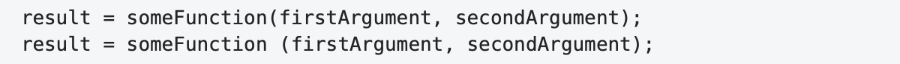
<!--  -->

There is no space on the first line, and the function name visually sticks to the first argument in the argument list. In addition to the difficulty in reading, we can also notice that the visual structure does not quite correctly reflect the logical structure of the program: the function call expression includes the function name and the argument list, the argument list includes the first and second arguments. In the first line, the function name is more strictly bound to the first argument than the arguments to each other.

One more example:

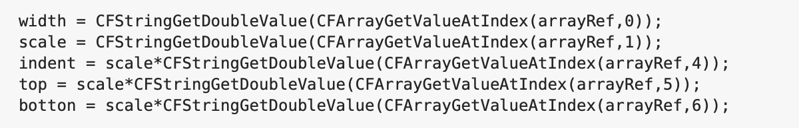

<!--  -->

After splitting into two groups, adding spaces and alignment:

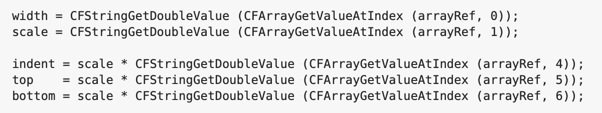

<!--  -->

In this case, the addition of spaces not only made it easier to read individual lines due to the explicit separation of identifiers within them, but (together with alignment) made it easier to compare them by forming compact visual groups horizontally. Trying to understand what this code does, you no longer have to read each line separately.

In the case when the total length of identifiers does not exceed the size of the recognition area, this requirement is not so critical, since the entire expression can be immediately captured with one glance:

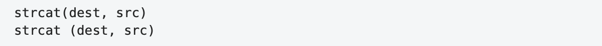

<!--  -->

### Arranging Curly Braces
Today, languages ​​with C-like syntax are dominated by two main ways of placing curly braces: in the first, the open parenthesis is on a separate line with the same indentation as the beginning of the preceding syntax element associated with it, and in the second, the open parenthesis is located at the end of the line containing the ending of such an element.

In what follows, I will conventionally call these styles _Allman_ and _One Truce Brace Style_ (_1TBS_) by the names of the most popular styles that use the appropriate brace placement rules.

Placing the opening parenthesis at the beginning of a single line in the _Allman_ style has the following advantages:

- The open brace is always located on the left side of the visual area, that is, in the area of greatest attention, and when scanning a code (in which vertical eye movements prevail), it always somehow falls into the area of focal vision. In the _1TBS_ style, the open parentheses are often in the right region of the code and only fall into the peripheral vision, which makes them much more difficult to detect. In other words, what in the first case occurs naturally, in the second requires additional and special efforts.
- Facilitated matching of opening and closing braces and, accordingly, defining the boundaries of the code block surrounded by them. Searching for a paired brace requires only vertical movement of the gaze, there is no text on its path from one brace to another, and the search proceeds in a known direction up to the first character.
   Indeed, whenever we see a closing parenthesis in the text on a separate line, we know that the matching opening parenthesis is _higher_, which means that the main and natural direction of searching for it will be upward search.
   When using _1TBS_, searching is generally more effortful due to the fact that it is carried out in a wide sector, with the view passing through the text that needs to be analyzed, and which often contains nested pairs of curly braces that visually compete with the target.
- The parenthesis is located at the beginning of the line, exactly where we expect to see the beginning of anything, and naturally denotes the beginning of the block of code. In the _1TBS_ style, because of its position at the end of a line, the open parenthesis often ceases to act as an explicit visual marker for the beginning of a block. Moreover, in some cases (for example, repeated `} else if` constructions), the closing brace of the previous block appears at the beginning of the line containing the construct preceding the new block, and thus visually connects to the beginning of this block. Thus, its formal and visual meanings cease to correspond to each other.
- Placing parentheses on separate lines naturally adds vertical spaces between the syntactic construction before the opening bracket and the framed code block, which, in most cases, better reflects the structure of the entire construction.
- The horizontal position of the opening brace in the style of _Allman_ uniquely determines the nesting level to which it belongs. _1TBS_ does not contain this information, since the location of the open brace is mainly determined only by the length of the line before it.

The disadvantages of _1TBS_ lead to the fact that the opening curly brace ceases to fully participate in the formation of the visual presentation of the code, the style provokes the programmer not to separate the code blocks inside the braces and their surrounding elements with empty lines, and as a result, the program text often looks like one poorly structured massive chunk:

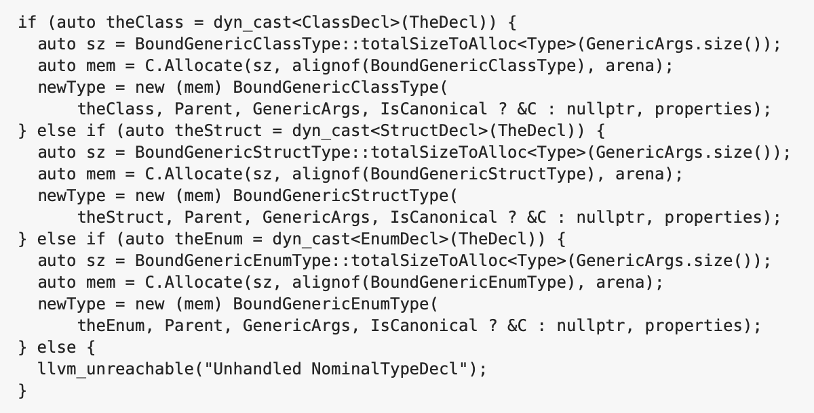

<!--  -->

The code in the example above demonstrates the main problems of the _1TBS_ style mentioned, namely: the absence of a clearly expressed visual structure, the inversion of the role of the closing braces, the loss of the visual significance of the opening braces, which, at a cursory glance at the code, are only approximately guessed using peripheral vision and their exact location requires additional horizontal eye movements. And this is an example of relatively simple code, since in it the conditions of the `if` expression occupy only one line, and the open braces are on the same line as the ` if` expression, and the code blocks inside the braces have a fairly simple linear structure and do not contain nested blocks.

Reformatting this code using the _Allman_ style allows for a more acceptable result:

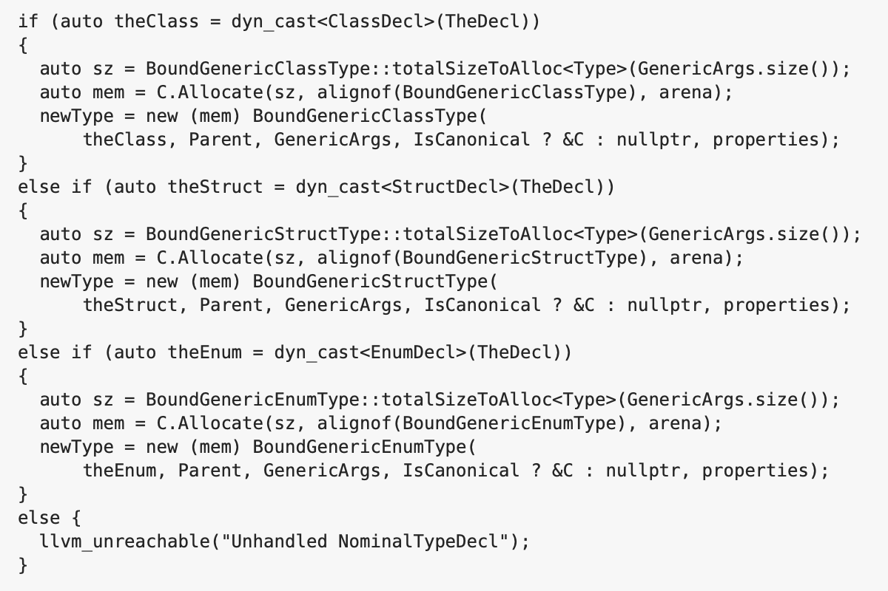

<!--  -->

Despite the fact that in most cases _Allman_ objectively outperforms _1TBS_, sometimes _1TBS_ is preferable. As a rule, in the such cases the additional vertical space formed by placing braces on separate lines in the style of _Allman_ leads to the fact that the whole structure becomes visually fragmented, loses its internal rhythm and ceases to be perceived as a single whole. And at the same time, when using _1TBS_, either the offset of the opening parenthesis is small and does not have a significant effect on the perception of the code, or its detection is not critical (for example, in the case of the `if` construction, when both the condition and the block of code occupy one line each).

So in the previous example, placing the last open brace at the end of the line looks quite natural, and the resulting empty space only adds a small accent, compensating for the small visual mass of the last block, consisting of only one line. When the brace is placed on a separate line, this space becomes too large, and this line looks torn off from the rest of the construction:

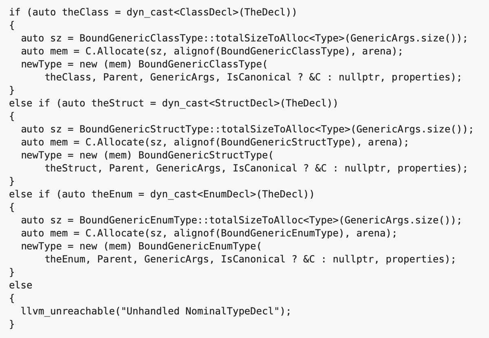

<!--  -->

The question arises: in what cases is it permissible to use _1TBS_? The following restrictions can be suggested:

- The open parenthesis is on the same line as the beginning of the syntactic construct of which it is a part.
- The parenthesis is not masked by a large mass of code directly adjacent to it (mostly from above).
- It is located in the left area of ​​the text (area of ​​greatest attention).
- The horizontal offset of the parenthesis should not be large, so that the parenthesis is in the recognition area (14-15 letter sizes).
- A block bounded by braces does not contain nested blocks such that the braces bounding these nested blocks are located close to the opening brace of the main block and visually compete with it.

Thus, the choice of the method for placing parentheses should be carried out in each specific case, and formal adherence to the "strict" placement rules sooner or later leads to an unsatisfactory result. The best option seems to be a combination of the _Allman_ (as the main) and _1TBS_ styles (as an auxiliary, used in rare cases).

## Conclusion
The formation of a readable, that is, easily comprehensible program text requires taking into account the specific features of human vision, such as ambient and focal vision, the mechanisms of reading text in general and the features of reading program texts in particular.

The main strategy for optimizing readability can be formulated as _making more efficient use of ambient vision and reducing the load on the focal one_.

The implementation of this strategy is achieved by forming the text in the form of a relatively compact horizontally "image" with a pronounced visual structure that correctly reflects the logical structure of the program. This image is formed by hierarchically grouping logically related program elements into compact visual areas by means of horizontal indentation,  blank lines and alignment. The ease of reading the program text is also ensured by the choice of identifiers that are optimal in terms of length and expressiveness and their explicit separation in the program text using spaces.

In his book on typography, Robert Bringhurst writes [¹²](#fn-12):
> *Headings, subheads, block quotations, footnotes, illustrations, captions and other intrusions into the text create syncopations and variations against the base rhythm of regularly leaded lines. These variations can and should add life to the page…*

> *However empty or full it may be, the page must breathe, and in a book — that is, in a long text fit for the reader to live in — the page must breath in both directions.*

Similarly, we can say that the structure of the program, unfolding in the text from top to bottom, also has a certain rhythm and variations. The task of the programmer is to visualize this rhythm, to make it explicit in general and in detail.

------
*¹) Величковский Б.М. Когнитивная наука. Основы психологии познания. Academia, Смысл, 2006. (Boris M. Velichkovsky. Cognitive Science: Foundations of Epistemic Psychology, 2006)*

*²) Yarbus A L. Eye Movements and Vision. New York: Plenum Press, 1967*

*³) Robert L.Solso. Cognitive psychology. 6-th edition. Allyn & Bacon, 2001*

*⁴) Rudolph Arnheim. Art and Visual Perception.  University of California Press, 1974*

*⁵) <a href="https://www.semanticscholar.org/paper/Eye-movements-in-reading-and-information-20-years-Rayner/87c8a7be8d5e2e2209e766c3e28a3e8ee5babb64">Eye Movements in Reading and Information Processing: 20 Years of Research. Keith Rayner – University of Massachusetts at Amherst</a>*

*⁶) <a href="https://researchonline.gcu.ac.uk/files/24953094/ICPC2015_authors_version.pdf">Eye Movements in Code Reading: Relaxing the Linear Order. Roman Bednarik, Bonita Sharif</a>*

*⁷) <a href="https://link.springer.com/article/10.3758/BF03206156">Saccade size in reading depends upon character spaces and not visual angle. Robert E. Morrison, Keith Rayner, 1981</a>*

*⁸) <a href="http://www.ptidej.net/courses/inf6306/fall10/slides/course8/Storey06-TheoriesMethodsToolsProgramComprehension.pdf">Theories, tools and research methods in program comprehension: Past, Present and Future. Margaret-Anne Storey</a>*

*⁹) <a href="http://www.cs.kent.edu/~jmaletic/papers/ICPC2010-CamelCaseUnderScoreClouds.pdf">An Eye Tracking Study on camelCase and under\_score Identifier Styles. Bonita Sharif and Jonathan I. Maletic – Department of Computer Science Kent State University</a>*

*¹⁰) <a href="http://www.cs.kent.edu/~jmaletic/Prog-Comp/Papers/letovsky-1986-software.pdf">S. Letovsky and E. Soloway, Delocalized plans and program comprehension, IEEE Software, pp. 41–49, 1986</a>*

*¹¹) <a href="http://emipws.org/wp-content/uploads/2015/02/emip2013_report.pdf">Eye movements in programming education: analysing the expert’s gaze. Simon. University of Newcastle, Australia</a>*

*¹²) Robert Bringhurst. Elements of Typographic Style. Hartley & Marks, Publishers, 1996* 

*¹³) Steve McConnell. Code Complete: A Practical Handbook of Software Construction. Microsoft Press, 2004*

*¹⁴) Alan Cooper. About Face: The Essentials of Interaction Design, Fourth Edition. John Wiley & Sons, Inc., 2014*

*¹⁵) <a href="https://www.sovsib.ru/docs/ost2912494.pdf">ОСТ 29.124–94. Издания книжные для взрослых читателей</a>*